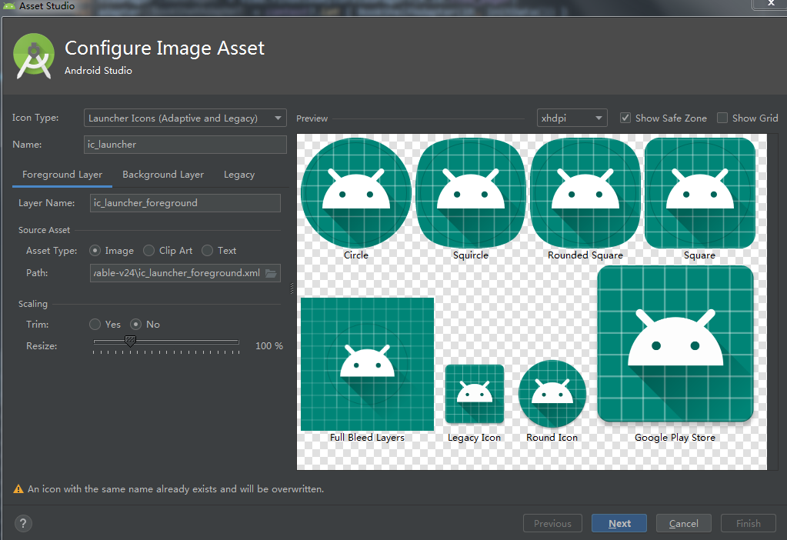

# 8.0系统的应用图标适配

从Android 8.0系统开始，应用程序的图标被分为了两层：**前景层** 和 **背景层**。前景用来展示应用图标的Logo，背景用来衬托应用图标的Logo。

背景层在设计的时候只允许定义颜色和纹理，但是不能定义形状。


可以看到，这里背景层是一张蓝色的网格图，前景层是一张Android机器人Logo图，然后盖上一层圆形的mask，最终就裁剪出了一张圆形的应用图标。 

如果你的APP中的 `targetSdkVersion` 是低于26的，那么就可以不用进行应用图标适配，否则需要进行适配。

另外在 Android 7.1（API 25）及更早版本中，启动图标的尺寸为 **48 x 48 dp**。现在必须按照以下准则调整图标图层的尺寸：

- 两个图层的尺寸都必须调整为：**108 x 108 dp**；
- 已遮挡的视图中显示的图标内层为：**72 x 72 dp**；
- 系统会为外层的 4 边保留 **18 dp** 的边距，以创建有趣的视觉效果（例如视差或脉动效果）。
注意：动画视觉效果由受支持的启动器生成。视觉效果可能因启动器而异。


## 如何适配

File -> New -> Image Asset，其中 **Foreground Layer** 用于编辑前景层， **Background Layer** 用于编辑背景层， **Legacy** 用于编辑老版本系统的图标。



可以修改大小使得前景层在安全区域内(即预览图中的圆圈)。注意两个预览图： **Legacy Icon** 和 **Round Icon**，前者是老版本系统的图标，后者是8.0及以上版本的图标。

## 如何加渠道角标

Android 8.0或以上系统的手机，都会使用 mipmap-anydpi-v26 目录下的 ic_launcher.xml 来作为图标，所以把该目录删除就好了。

```xml
<?xml version="1.0" encoding="utf-8"?>
<adaptive-icon xmlns:android="http://schemas.android.com/apk/res/android">
    <background android:drawable="@drawable/ic_launcher_background" />
    <foreground android:drawable="@drawable/ic_launcher_foreground" />
</adaptive-icon>
```

