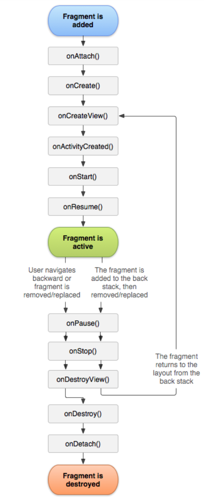
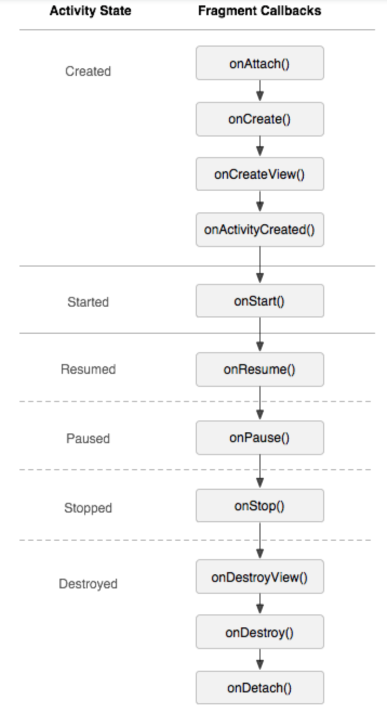

# Fragment

Android 在 Android 3.0（API 级别 11）中引入了片段，主要是为了给大屏幕（如平板电脑）上更加动态和灵活的 UI 设计提供支持。

## 生命周期



与 Activity 生命周期对比：



只要需要实现几个：

**`onCreate()`**

系统会在创建片段时调用此方法。您应该在实现内初始化您想在片段暂停或停止后恢复时保留的必需片段组件。

**`onCreateView()`**

系统会在片段首次绘制其用户界面时调用此方法。 要想为您的片段绘制 UI，您从此方法中返回的 View 必须是片段布局的根视图。如果片段未提供 UI，您可以返回 null。

**`onPause()`**

系统将此方法作为用户离开片段的第一个信号（但并不总是意味着此片段会被销毁）进行调用。 您通常应该在此方法内确认在当前用户会话结束后仍然有效的任何更改（因为用户可能不会返回）。

其他周期说明：

**`onAttach()`**

在片段已与 Activity 关联时调用（Activity 传递到此方法内）。

**`onCreateView()`**

调用它可创建与片段关联的视图层次结构。

**`onActivityCreated()`**

在 Activity 的 onCreate() 方法已返回时调用。

**`onDestroyView()`**

在移除与片段关联的视图层次结构时调用。

**`onDetach()`**

在取消片段与 Activity 的关联时调用。

## 其他子类

**`DialogFragment`**

显示浮动对话框。使用此类创建对话框可有效地替代使用 `Activity` 类中的对话框帮助程序方法，因为您可以将片段对话框纳入由 `Activity` 管理的片段返回栈，从而使用户能够返回清除的片段。

**`ListFragment`**

显示由适配器（如 SimpleCursorAdapter）管理的一系列项目，类似于 `ListActivity`。它提供了几种管理列表视图的方法，如用于处理点击事件的 `onListItemClick()` 回调。

**`PreferenceFragment`**

以列表形式显示 `Preference` 对象的层次结构，类似于 `PreferenceActivity`。这在为您的应用创建“设置” `Activity` 时很有用处。

## 添加用户界面

要想为片段提供布局，您必须实现 `onCreateView()` 回调方法，Android 系统会在片段需要绘制其布局时调用该方法。您对此方法的实现返回的 `View` 必须是片段布局的根视图。

```java
public static class ExampleFragment extends Fragment {
    @Override
    public View onCreateView(LayoutInflater inflater, ViewGroup container,
                             Bundle savedInstanceState) {
        // Inflate the layout for this fragment
        return inflater.inflate(R.layout.example_fragment, container, false);
    }
}
```

三个参数：

- 您想要扩展的布局的资源 ID；
- 将作为扩展布局父项的 ViewGroup；
- 指示是否应该在扩展期间将扩展布局附加至 ViewGroup（第二个参数）的布尔值。（在本例中，其值为 `false`，因为系统已经将扩展布局插入 `container` — 传递 `true` 值会在最终布局中创建一个多余的视图组。）

## 向 `Activity` 添加片段

### 在 `Activity` 的布局文件内声明片段

```xml
<?xml version="1.0" encoding="utf-8"?>
<LinearLayout xmlns:android="http://schemas.android.com/apk/res/android"
    android:orientation="horizontal"
    android:layout_width="match_parent"
    android:layout_height="match_parent">
    <fragment android:name="com.example.news.ArticleListFragment"
            android:id="@+id/list"
            android:layout_weight="1"
            android:layout_width="0dp"
            android:layout_height="match_parent" />
    <fragment android:name="com.example.news.ArticleReaderFragment"
            android:id="@+id/viewer"
            android:layout_weight="2"
            android:layout_width="0dp"
            android:layout_height="match_parent" />
</LinearLayout>
```

> 每个片段都需要一个唯一的标识符，`id` 或者 `tag`

### 通过编程方式将片段添加到某个现有 `ViewGroup`

```java
FragmentManager fragmentManager = getFragmentManager();
FragmentTransaction fragmentTransaction = fragmentManager.beginTransaction();
ExampleFragment fragment = new ExampleFragment();
fragmentTransaction.add(R.id.fragment_container, fragment);
fragmentTransaction.commit();
```

### 添加没有 UI 的片段

要想添加没有 UI 的片段，请使用 `add(Fragment, String)` 从 `Activity` 添加片段（为片段提供一个唯一的字符串“标记”，而不是视图 ID）。 这会添加片段，但由于它并不与 `Activity` 布局中的视图关联，因此不会收到对 `onCreateView()` 的调用。因此，您不需要实现该方法。

## 片段事务

管理片段用 `FragmentManager`，可执行的操作为：

- 通过 `findFragmentById()`（对于在 Activity 布局中提供 UI 的片段）或 `findFragmentByTag()`（对于提供或不提供 UI 的片段）获取 Activity 中存在的片段
- 通过 `popBackStack()`（模拟用户发出的返回命令）将片段从返回栈中弹出。
- 通过 `addOnBackStackChangedListener()` 注册一个侦听返回栈变化的侦听器。

举例：将一个片段替换成另一个片段，以及如何在返回栈中保留先前状态

```java
// Create new fragment and transaction
Fragment newFragment = new ExampleFragment();
FragmentTransaction transaction = getFragmentManager().beginTransaction();

// Replace whatever is in the fragment_container view with this fragment,
// and add the transaction to the back stack
transaction.replace(R.id.fragment_container, newFragment);
transaction.addToBackStack(null);

// Commit the transaction
transaction.commit();
```

有几个需要注意的地方：

- 必须最后调用 `commit()`
- 对于每个片段事务，您都可以通过在提交前调用 `setTransition()` 来应用过渡动画。
- 调用 `commit()` 不会立即执行事务，而是在 Activity 的 UI 线程（“主”线程）可以执行该操作时再安排其在线程上运行,也可以从 UI 线程调用 `executePendingTransactions()` 以立即执行 `commit()` 提交的事务。通常不必这样做，除非其他线程中的作业依赖该事务。

**强烈注意：**

您只能在 Activity 保存其状态（用户离开 Activity）之前使用 `commit()` 提交事务。如果您试图在该时间点后提交，则会引发异常。 这是因为如需恢复 Activity，则提交后的状态可能会丢失。 对于丢失提交无关紧要的情况，请使用 `commitAllowingStateLoss()`。

所以建议直接使用 `commitAllowingStateLoss()`，避免引发异常！

## 与 Activity 通信

片段可以通过 getActivity() 访问 Activity 实例，并轻松地执行在 Activity 布局中查找视图等任务。

```java
View listView = getActivity().findViewById(R.id.list);
```

 Activity 也可以使用 `findFragmentById()` 或 `findFragmentByTag()`，通过从 `FragmentManager` 获取对 `Fragment` 的引用来调用片段中的方法。

 ```java
 ExampleFragment fragment = (ExampleFragment) getFragmentManager().findFragmentById(R.id.example_fragment);
 ```

 ### 创建对 Activity 的事件回调

 在某些情况下，您可能需要通过片段与 Activity 共享事件。

 ```java
 public static class FragmentA extends ListFragment {
    ...
    // Container Activity must implement this interface
    public interface OnArticleSelectedListener {
        public void onArticleSelected(Uri articleUri);
    }

    OnArticleSelectedListener mListener;

    @Override
    public void onAttach(Activity activity) {
        super.onAttach(activity);
        try {
            mListener = (OnArticleSelectedListener) activity;
        } catch (ClassCastException e) {
            throw new ClassCastException(activity.toString() + " must implement OnArticleSelectedListener");
        }
    }

    @Override
    public void onListItemClick(ListView l, View v, int position, long id) {
        // Append the clicked item's row ID with the content provider Uri
        Uri noteUri = ContentUris.withAppendedId(ArticleColumns.CONTENT_URI, id);
        // Send the event and Uri to the host activity
        mListener.onArticleSelected(noteUri);
    }
    ...
}
 ```

 然后在Activity 中实现 `OnArticleSelectedListener` 接口即可。

 > 两个 `Fragment` 永远不应该直接通信，可以通过 `Activity` 。

## 向应用栏添加项目

您的片段可以通过实现 `onCreateOptionsMenu()` 向 Activity 的选项菜单（并因此向应用栏）贡献菜单项。不过，为了使此方法能够收到调用，您必须在 `onCreate()` 期间调用 `setHasOptionsMenu()`，以指示片段想要向选项菜单添加菜单项（否则，片段将不会收到对 `onCreateOptionsMenu()` 的调用）。

知道可以这么做就行，实际很少需要这么做。

## 完整示例

[看这里](https://developer.android.google.cn/samples?hl=zh-cn#Fragment)

## 不创建实例的方法

主界面的底部导航会用到Fragment，如果用 `replace` ，每次切换都会重新加载界面，不仅体验不好，而且浪费资源。

所以最好使用 `show` 和 `hide` 来隐藏/显示。

举例：

```kotlin
class FragmentUtil {

    companion object {
        fun show(fragmentManager: FragmentManager, containerId:Int, fragment: Fragment) {
            hide(fragmentManager)
            if (fragmentManager.fragments.contains(fragment)) {
                fragmentManager.beginTransaction().show(fragment).commit()
            } else {
                add(fragmentManager, containerId, fragment)
            }
        }

        fun hide(fragmentManager: FragmentManager) {
            val transaction: FragmentTransaction = fragmentManager.beginTransaction()
            for (fragment:Fragment in fragmentManager.fragments) {
                transaction.hide(fragment)
            }
            transaction.commit()
        }

        fun add(fragmentManager: FragmentManager, containerId:Int, fragment: Fragment) {
            fragmentManager.beginTransaction().add(containerId, fragment).commit()
        }
    }
}
```