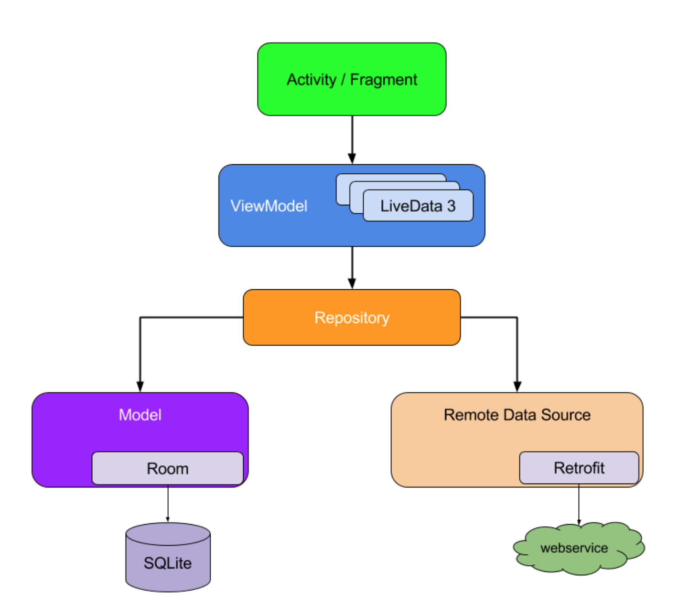
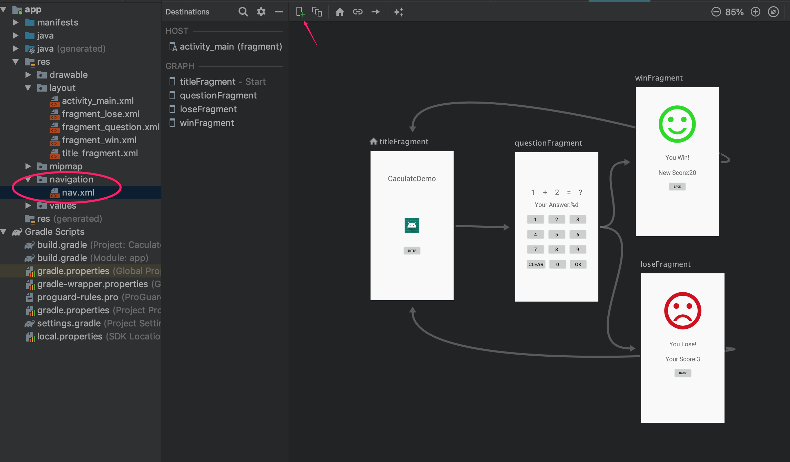

- [Android Jetpack](#android-jetpack)
  - [1. 在应用中使用 Jetpack 库](#1-%e5%9c%a8%e5%ba%94%e7%94%a8%e4%b8%ad%e4%bd%bf%e7%94%a8-jetpack-%e5%ba%93)
  - [2. Android KTX](#2-android-ktx)
  - [3. v7 支持库](#3-v7-%e6%94%af%e6%8c%81%e5%ba%93)
    - [3.1 v7 appcompat库](#31-v7-appcompat%e5%ba%93)
    - [3.2 v7 Cardview库](#32-v7-cardview%e5%ba%93)
    - [3.3 v7网格布局库](#33-v7%e7%bd%91%e6%a0%bc%e5%b8%83%e5%b1%80%e5%ba%93)
    - [3.4 v7调色板库](#34-v7%e8%b0%83%e8%89%b2%e6%9d%bf%e5%ba%93)
    - [3.5 v7 recyclerview库](#35-v7-recyclerview%e5%ba%93)
    - [3.6 v13支持库](#36-v13%e6%94%af%e6%8c%81%e5%ba%93)
    - [3.7 矢量可绘制库](#37-%e7%9f%a2%e9%87%8f%e5%8f%af%e7%bb%98%e5%88%b6%e5%ba%93)
    - [3.8 动画矢量可绘制库](#38-%e5%8a%a8%e7%94%bb%e7%9f%a2%e9%87%8f%e5%8f%af%e7%bb%98%e5%88%b6%e5%ba%93)
    - [3.9 注释支持库](#39-%e6%b3%a8%e9%87%8a%e6%94%af%e6%8c%81%e5%ba%93)
    - [3.10 设计支持库](#310-%e8%ae%be%e8%ae%a1%e6%94%af%e6%8c%81%e5%ba%93)
    - [3.11 自定义标签支持库](#311-%e8%87%aa%e5%ae%9a%e4%b9%89%e6%a0%87%e7%ad%be%e6%94%af%e6%8c%81%e5%ba%93)
  - [4. Jetpack App 架构](#4-jetpack-app-%e6%9e%b6%e6%9e%84)
    - [4.1 Model](#41-model)
    - [4.2 View](#42-view)
    - [4.3 Controller](#43-controller)
    - [4.4 Lifecycle 生命周期](#44-lifecycle-%e7%94%9f%e5%91%bd%e5%91%a8%e6%9c%9f)
    - [4.5 Navication 导航](#45-navication-%e5%af%bc%e8%88%aa)
  
# Android Jetpack

Jetpack 是一套库、工具和指南，可帮助开发者更轻松地编写优质应用。这些组件可帮助您遵循最佳做法、让您摆脱编写样板代码的工作并简化复杂任务，以便您将精力集中放在所需的代码上。

## 1. 在应用中使用 Jetpack 库

打开您的项目的 build.gradle 文件并添加 google() 代码库，如下所示：

```
allprojects {
    repositories {
        google()
        jcenter()
    }
}
```

然后，您可以添加 Jetpack 组件，例如作为 Lifecycles 库的一部分的 LiveData 和 ViewModel 等架构组件，如下所示：

```
dependencies {
    def lifecycle_version = "2.0.0"
    implementation "androidxlifecycle:lifecycle-extensions:$lifecycle_version"
    // Optional : Kotlin extension (https://d.androidcom/kotlin/ktx)
    implementation "androidxlifecycle:lifecycle-viewmodel-ktx:$lifecycle_versio"
    ...
}
```

## 2. Android KTX

Android KTX 是一组 Kotlin 扩展程序，属于 Android Jetpack 系列。它优化了供 Kotlin 使用的 Jetpack 和 Android 平台 API。Android KTX 旨在让您利用 Kotlin 语言功能（例如扩展函数/属性、lambda、命名参数和参数默认值），以更简洁、更愉悦、更惯用的方式使用 Kotlin 进行 Android 开发。Android KTX 不会向现有的 Android API 添加任何新功能。


## 3. v7 支持库  

### 3.1 v7 appcompat库

该库增加了对 操作栏用户界面设计模式的支持。

添加依赖

    com.android.support:appcompat-v7:28.0.0

以下是v7 appcompat库中包含的一些关键类：

- [ActionBar](https://developer.android.com/reference/androidx/appcompat/app/ActionBar.html)-提供操作栏 用户界面模式的实现
- [AppCompatActivity](https://developer.android.com/reference/androidx/appcompat/app/AppCompatActivity.html) -添加了一个应用程序活动类，该类可以用作使用支持库操作栏实现的活动的基类
- [AppCompatDialog](https://developer.android.com/reference/androidx/appcompat/app/AppCompatDialog.html) -添加一个对话框类，可用作AppCompat主题对话框的基类
- [ShareActionProvider](https://developer.android.com/reference/androidx/appcompat/widget/ShareActionProvider.html) -添加了对可包含在操作栏中的标准化共享操作（例如电子邮件或发布到社交应用程序）的支持

### 3.2 v7 Cardview库

该库增加了对 `CardView` 小部件的支持，使您可以在卡片上显示信息，这些卡片在任何应用程序上的外观都一致。

添加依赖：

    com.android.support:cardview-v7:28.0.0

### 3.3 v7网格布局库

该库添加对 `GridLayout` 类的支持 ，使您可以使用矩形单元格的网格来排列用户界面元素。

添加依赖：

    com.android.support:gridlayout-v7:28.0.0

### 3.4 v7调色板库

v7调色板支持库包括 `Palette` 类，该类使您可以从图像中提取突出的颜色。例如，音乐应用程序可以使用一个 Palette对象从专辑封面中提取主要颜色，然后使用这些颜色构建颜色协调的歌曲标题卡。

添加依赖：

    com.android.support:palette-v7:28.0.0

### 3.5 v7 recyclerview库

recyclerview库添加了 `RecyclerView` 该类。此类提供对RecyclerView 小部件的支持，该小部件是通过提供有限的数据项窗口来有效显示大型数据集的视图。

添加依赖：

    com.android.support:recyclerview-v7:28.0.0

### 3.6 v13支持库

V4片段库提供了一个Fragment类。v4 Fragment类是一个独立的类，提供了在更高平台版本中添加的错误修复，而v13 `FragmentCompat` 类为该类的框架实现提供了兼容性修补程序Fragment。

添加依赖：

    com.android.support:support-v13:28.0.0

### 3.7 矢量可绘制库

提供对静态矢量图形的支持。

    com.android.support:support-vector-drawable:28.0.0

### 3.8 动画矢量可绘制库

提供对动画矢量图形的支持。

    com.android.support:animated-vector-drawable:28.0.0

### 3.9 注释支持库

该注释包提供的API来支持添加注释元数据您的应用程序。

    com.android.support:support-annotations:28.0.0

### 3.10 设计支持库

设计支持库为应用程序开发人员添加了对各种材料设计组件和模式的支持，例如navigation drawers, floating action buttons (FAB), snackbars, and tabs

    com.android.support:design:28.0.0

### 3.11 自定义标签支持库

在 自定义选项卡 包提供的API支持添加和您的应用程序管理的自定义选项卡。

    com.android.support:customtabs:28.0.0

## 4. Jetpack App 架构

Jetpack 里的架构和以往已经大不相同，主要思想是模型驱动界面。



### 4.1 Model

`LiveData` 是一种可观察的数据存储器。应用中的其他组件可以使用此存储器监控对象的更改，而无需在它们之间创建明确且严格的依赖路径。`LiveData` 组件还遵循应用组件（如 `Activity`、`Fragment` 和 `Service`）的生命周期状态，并包括清理逻辑以防止对象泄漏和过多的内存消耗。

**如何使用**

1. 继承 `ViewModel` 类
2. 监听字段类型用 `MutableLiveData<T>`
3. 设置监听

**举例**

```kotlin
import androidx.lifecycle.MutableLiveData
import androidx.lifecycle.ViewModel
import kotlin.properties.Delegates

class MyViewModel : ViewModel() {

    private lateinit var aTeamScore: MutableLiveData<Int>
    private lateinit var bTeamScore: MutableLiveData<Int>

    private var aBack by Delegates.notNull<Int>()
    private var bBack by Delegates.notNull<Int>()

//    写一个判断初始化的方法，然后通过这个方法去得到是否初始化
    fun isATeamScoreInitialzed()=::aTeamScore.isInitialized
    fun isBTeamScoreInitialzed()=::bTeamScore.isInitialized


    fun getAScore(): MutableLiveData<Int> {
        if (!isATeamScoreInitialzed()) {
            aTeamScore = MutableLiveData(0)
        }
        return aTeamScore
    }

    fun addAScore(add:Int) {
        aBack = aTeamScore.value!!
        bBack = bTeamScore.value!!
        aTeamScore.value = aTeamScore.value?.plus(add)
    }

    fun getBScore(): MutableLiveData<Int> {
        if (!isBTeamScoreInitialzed()) {
            bTeamScore = MutableLiveData(0)
        }
        return bTeamScore
    }

    fun addBScore(add: Int) {
        aBack = aTeamScore.value!!
        bBack = bTeamScore.value!!
        bTeamScore.value = bTeamScore.value?.plus(add)
    }

    fun reset() {
        aTeamScore.value = 0
        bTeamScore.value = 0
    }

    fun undo() {
        aTeamScore.value = aBack
        bTeamScore.value = bBack
    }
}
```

### 4.2 View

数据绑定库 `Databing` 是一种支持库，借助该库，您可以使用声明性格式（而非程序化地）将布局中的界面组件绑定到应用中的数据源。

**搭建环境**

要将应用程序配置为使用数据绑定，请将dataBinding元素添加到 *build.gradle* 应用程序模块中的文件中：

```
android {
    ...
    dataBinding {
        enabled = true
    }
}
```

然后导入包

```
    def lifecycle_version = "2.0.0"
    implementation "androidx.lifecycle:lifecycle-extensions:$lifecycle_version"
    // Optional : Kotlin extension (https://d.android.com/kotlin/ktx)
    implementation "androidx.lifecycle:lifecycle-viewmodel:$lifecycle_version"
```

**布局和绑定表达式**

借助表达式语言，您可以编写将变量关联到布局中的视图的表达式。数据绑定库会自动生成将布局中的视图与您的数据对象绑定所需的类。该库提供了可在布局中使用的导入、变量和头文件等功能。

就是在原有的布局上增加layout根目录，然后使用data标签定义变量。

> Android Studio 可以一键转换，不用从头开始写。

**如何使用**

1. 新增 `data` 标签，设置变量 `variable`；
2. 将布局中的界面组件的数据用变量表示；
3. 在Activity中绑定。

**举例**

```xml
<?xml version="1.0" encoding="utf-8"?>
<layout xmlns:android="http://schemas.android.com/apk/res/android"
    xmlns:app="http://schemas.android.com/apk/res-auto"
    xmlns:tools="http://schemas.android.com/tools">

    <data>
        <variable
            name="score"
            type="com.ren.scoreboard.MyViewModel" />
    </data>

    <androidx.constraintlayout.widget.ConstraintLayout
        android:layout_width="match_parent"
        android:layout_height="match_parent"
        tools:context=".MainActivity">

        <Button
            android:id="@+id/button6"
            android:layout_width="0dp"
            android:layout_height="wrap_content"
            android:background="@color/colorAccent"
            android:text="@string/add_3"
            android:textColor="@android:color/white"
            android:textSize="@dimen/btn_text_size"
            app:layout_constraintBottom_toTopOf="@+id/guideline7"
            app:layout_constraintEnd_toStartOf="@+id/guideline11"
            app:layout_constraintStart_toStartOf="@+id/guideline9"
            app:layout_constraintTop_toTopOf="@+id/guideline6"
            android:onClick="@{()->score.addAScore(3)}"/>

        <TextView
            android:id="@+id/textView"
            android:layout_width="wrap_content"
            android:layout_height="wrap_content"
            android:text="@string/team_a_name"
            android:textColor="@android:color/background_dark"
            android:textSize="@dimen/team_title"
            app:layout_constraintBottom_toTopOf="@+id/guideline3"
            app:layout_constraintEnd_toStartOf="@+id/guideline2"
            app:layout_constraintStart_toStartOf="parent"
            app:layout_constraintTop_toTopOf="@+id/guideline" />

        <TextView
            android:id="@+id/textView2"
            android:layout_width="wrap_content"
            android:layout_height="wrap_content"
            android:text="@string/team_b_name"
            android:textColor="@android:color/background_dark"
            android:textSize="@dimen/team_title"
            app:layout_constraintBottom_toTopOf="@+id/guideline3"
            app:layout_constraintEnd_toEndOf="parent"
            app:layout_constraintStart_toStartOf="@+id/guideline2"
            app:layout_constraintTop_toTopOf="@+id/guideline" />

    </androidx.constraintlayout.widget.ConstraintLayout>
</layout>
```

其中data描述了可以在此布局中使用的属性， `@{}` 语法则将布局内的表达式写入属性属性中。

**表达语言**

您可以在表达式语言中使用以下运算符和关键字

- 数学的 `+ - / * %`
- 字符串串联 `+`
- 逻辑上 `&& ||`
- 二元 `& | ^`
- 一元 `+ - ! ~`
- 转移 `>> >>> <<`
- 比较` == > < >= <=`（请注意，<必须转义为&lt;）
- instanceof
- 分组 ()
- 文字-字符，字符串，数字， null
- 投
- 方法调用
- 现场访问
- 阵列存取 []
- 三元运算符 `?:`

举例

```
android:text="@{String.valueOf(index + 1)}"
android:visibility="@{age > 13 ? View.GONE : View.VISIBLE}"
android:transitionName='@{"image_" + id}'
```

**空合并运算符**

如果前一个是null则选择后一个，等效与三目运算符 `a==null?a:b`

    android:text="@{user.displayName ?? user.lastName}"

为了方便起见，可以使用运算符来访问常见集合，例如数组，列表，稀疏列表和映射

```
<data>
    <import type="android.util.SparseArray"/>
    <import type="java.util.Map"/>
    <import type="java.util.List"/>
    <variable name="list" type="List&lt;String>"/>
    <variable name="sparse" type="SparseArray&lt;String>"/>
    <variable name="map" type="Map&lt;String, String>"/>
    <variable name="index" type="int"/>
    <variable name="key" type="String"/>
</data>
…
android:text="@{list[index]}"
…
android:text="@{sparse[index]}"
…
android:text="@{map[key]}"
```

**字符串文字**

字符串文字应该用反引号引起来,而不是单引号（这么奇怪的吗）

    android:text="@{map[`firstName`]}"

**资源资源**

您可以使用以下语法访问表达式中的资源

    android:padding="@{large? @dimen/largePadding : @dimen/smallPadding}"

**导入，变量和包括**

导入使您可以轻松引用布局文件中的类。变量使您能够描述可在绑定表达式中使用的属性。包括让您在整个应用程序中重复使用复杂的布局。

1.导入

```xml
<data>
    <import type="android.view.View"/>
    <variable name="user" type="com.dyb.User" />
    <import type="com.example.MyStringUtils"/>
</data>
<TextView
   android:text="@{user.lastName}"
   android:layout_width="wrap_content"
   android:layout_height="wrap_content"
   android:visibility="@{user.isAdult ? View.VISIBLE : View.GONE}"/>

<TextView
   android:text="@{MyStringUtils.capitalize(user.lastName)}"
   android:layout_width="wrap_content"
   android:layout_height="wrap_content"/>
```

也可以使用别名

```xml
<import type="com.example.real.estate.View"
        alias="Vista"/>
```

### 4.3 Controller

Activity 或者 Fragment 不仅负责界面交互，还要负责监听数据变化，更新UI。

**如何使用**

1. 获取绑定对象；
2. 获取 `ViewModel` 对象;
3. 连接并设置监听。

**举例**

```kotlin
import androidx.appcompat.app.AppCompatActivity
import android.os.Bundle
import androidx.databinding.DataBindingUtil
import androidx.lifecycle.ViewModelProvider
import com.ren.scoreboard.databinding.ActivityMainBinding

class MainActivity : AppCompatActivity() {

    private lateinit var myViewModel:MyViewModel

    private lateinit var binding: ActivityMainBinding

    override fun onCreate(savedInstanceState: Bundle?) {
        super.onCreate(savedInstanceState)
        binding = DataBindingUtil.setContentView(this, R.layout.activity_main)
        myViewModel = ViewModelProvider.AndroidViewModelFactory(application).create(MyViewModel::class.java)
        binding.score = myViewModel
        binding.lifecycleOwner = this
    }
}
```

架构中其他的部分以后再补充。

### 4.4 Lifecycle 生命周期

生命周期感知，用于解耦在生命周期函数中的操作。

感觉用得不多，SDK倒是可以这样写，但是SDK又不能引入Jetpack。

1. 新建一个类实现 `LifecycleObserver`；
2. 新增注解函数；
3. Activity中添加监听。

举例：

```kotlin
class MyChronometer(context: Context?, attrs: AttributeSet?) : Chronometer(context, attrs), LifecycleObserver {

    private var time:Long = 0

    @OnLifecycleEvent(Lifecycle.Event.ON_PAUSE)
    private fun pauseMeter() {
        time = SystemClock.elapsedRealtime() - base
    }

    @OnLifecycleEvent(Lifecycle.Event.ON_RESUME)
    private fun resumeMeter() {
        base = SystemClock.elapsedRealtime() - time
        start()
    }
}
```

```kotlin
override fun onCreate(savedInstanceState: Bundle?) {
    val myChronometer = findViewById<MyChronometer>(R.id.meter)
    lifecycle.addObserver(myChronometer)
}
```

### 4.5 Navication 导航

用于 Fragment 导航，因为Google提倡使用一个Activity，其他界面使用Fragment。

1. 在 *res* 目录中新建 `Navigation` 文件；
2. 点击左上角加号，New Destination；
3. 依次添加主界面（Host Fragment），以及导航到其他Fragment；
4. 回到 Activity 的 layout 文件中，在 Containers 里选择 `NavHostFragment`，会提示选择 `Navigation` 文件，选择刚刚创建的。




导航：

```java
NavController controller = Navigation.findNavController(v);
controller.navigate(R.id.action_wordsFragment_to_addFragment);
```

`id` 是在 `Navigation` 文件中连线时系统自动创建的。

导航返回：

```java
NavController controller = Navigation.findNavController(v);
controller.navigateUp();
```