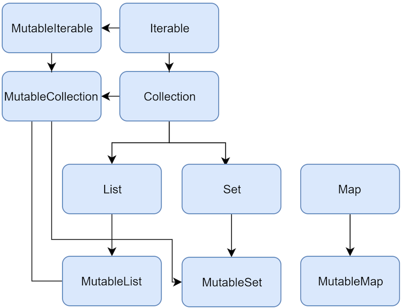

# Kotlin 补充

## 变量

- `val` 用于值从不更改的变量。
- `var` 用于值可以更改的变量。

可以声明变量，也可以不声明，编译器会推断。

也不需要分号结尾。

先声明变量，再声明类型。

举例：

```kotlin
var count: Int = 10
var x = 1
// 字符串格式化,使用 $ 号，不再使用 % 号
println("x=$x")
```

## Null安全

默认情况下，Kotlin 变量不能持有 null 值。

要使变量持有 null 值，它必须是可为 null 类型。可以在变量类型后面加上 ? 后缀，将变量指定为可为 null

```kotlin
val languageName: String? = null
// 方式一：判断是否为空
if (languageName != null) {
    // No need to write languageName?.toUpperCase()
    println(languageName.toUpperCase())
}
// 方式二：安全调用
// 但是该表达式有可能返回null
languageName?.length
// 方式三：判断返回null，使用默认值
val trim = languageName?.trim() ?: "Default name"
```

## 条件语句

普通的if-else

> 注意：Kotlin 不包含传统的三元运算符，而是倾向于使用条件表达式。

随着条件语句的复杂性不断增加，您可以考虑将 if-else 表达式替换为 when 表达式

```kotlin
val answerString = when {
    count == 42 -> "I have the answer."
    count > 35 -> "The answer is close."
    else -> "The answer eludes me."
}

println(answerString)
```

## 函数

要声明函数，请使用 `fun` 关键字，后跟函数名称。

可以将 return 关键字替换为赋值运算符

```kotlin
fun generateAnswerString(count: Int): String {
    return if (count == 42) {
        "I have the answer."
    } else {
        "The answer eludes me"
    }
}
```

**简化版**

省略return

```kotlin
fun generateAnswerString(countThreshold: Int): String = if (count > countThreshold) {
        "I have the answer"
    } else {
        "The answer eludes me"
    }
```

**匿名函数**

```kotlin
val stringLengthFunc: (String) -> Int = { input ->
    input.length
}

val stringLength: Int = stringLengthFunc("Android")
```


**高阶函数**

一个函数可以将另一个函数当作参数。

```kotlin
fun stringMapper(str: String, mapper: (String) -> Int): Int {
    // Invoke function
    return mapper(str)
}

// 调用，使用匿名函数
stringMapper("Android", { input ->
    input.length
})

// 如果匿名函数是在某个函数上定义的最后一个参数，则您可以在用于调用该函数的圆括号之外传递它
stringMapper("Android") { input ->
    input.length
}
```
## lateinit

在 Kotlin 中，您必须在声明对象时初始化对象的属性。

您可以使用 `lateinit` 推迟属性初始化。使用 `lateinit` 时，您应尽快初始化属性。

> 完全可以赋值为默认空值，比如字符串是 `""`, 数字是0，所以该功能是花里胡哨

```kotlin
class LoginFragment : Fragment() {

    private lateinit var usernameEditText: EditText
    private lateinit var passwordEditText: EditText
    private lateinit var loginButton: Button
    private lateinit var statusTextView: TextView

    override fun onViewCreated(view: View, savedInstanceState: Bundle?) {
        super.onViewCreated(view, savedInstanceState)

        usernameEditText = view.findViewById(R.id.username_edit_text)
        passwordEditText = view.findViewById(R.id.password_edit_text)
        loginButton = view.findViewById(R.id.login_button)
        statusTextView = view.findViewById(R.id.status_text_view)
    }

    ...
}
```

## SAM 转换

对于单一抽象方法，比如 `OnClickListener` ，在 Kotlin 中可以使用匿名函数来表示。

在 Java8以上可以用 Lampda 表达式。

```kotlin
val btn: Button = findViewById(R.id.button2)
btn.setOnClickListener {
    println("you click me")
}
```

## 伴生对象

就是 Java 中的 `static` 。

```kotlin
class LoginFragment : Fragment() {

    ...

    companion object {
        const val TAG = "LoginFragment"
    }
}
// 调用
LoginFragment.TAG
```

## 相等性

Kotlin 分为两类相等性：

- 构成相等使用 `==` 运算符，并调用 `equals()` 来确定两个实例是否相等。
- 引用相等使用 `===` 运算符，以检查两个引用是否指向同一对象。

## 默认参数与具名参数

Kotlin 也支持默认参数与具名参数，和Python相同。

## 示例

```kotlin
/*
  在将此类标记为 data 类后，编译器便会自动创建 getter 和 setter。
  此外，其还会派生 equals()、hashCode() 和 toString() 函数。
 */
data class User(var firstName: String, var lastName: String? = "Org")

fun main() {
    var user = User("James")
    var user1 = User("James", "Leblorn")
    var user2 = User("James", lastName = "Adward")
    println(user == user2) // 调用 equals 函数
    println(user === user1)
    // 扩展属性和方法
    user.userFormattedName
    user.getFormattedName()

    Repository.instance?.formattedUserNames
}
```

```kotlin
/**
 * 在 Kotlin 中，主构造函数无法包含任何代码，因此初始化代码会置于 init 块中。不过，二者功能完全相同。
 */
class Repository private constructor() {
    private var users: MutableList<User?>? =
        null

    fun getUsers(): List<User?>? {
        return users
    }

    val formattedUserNames: List<String>
        get() {
            val userNames: MutableList<String> =
                ArrayList(users!!.size)
            for (user in users!!) {
                var name: String
                name = user!!.firstName + " " + user.lastName
                userNames.add(name)
            }
            return userNames
        }

    // 相当于Java中的单例构造函数
    companion object {
        private var INSTANCE: Repository? = null
        val instance: Repository?
            get() {
                if (INSTANCE == null) {
                    synchronized(Repository::class.java) {
                        if (INSTANCE == null) {
                            INSTANCE =
                                Repository()
                        }
                    }
                }
                return INSTANCE
            }
    }

    // keeping the constructor private to enforce the usage of getInstance
    init {
        val user1 =
            User("Jane", "")
        val user2 =
            User("John", null)
        val user3 =
            User("Anne", "Doe")
        users = ArrayList()
        users!!.add(user1)
        users!!.add(user2)
        users!!.add(user3)
    }
}

// extension function
fun User.getFormattedName(): String {
    return if (lastName != null) {
        if (firstName != null) {
            "$firstName $lastName"
        } else {
            lastName ?: "Unknown"
        }
    } else {
        firstName ?: "Unknown"
    }
}

// extension property
val User.userFormattedName: String
    get() {
        return if (lastName != null) {
            if (firstName != null) {
                "$firstName $lastName"
            } else {
                lastName ?: "Unknown"
            }
        } else {
            firstName ?: "Unknown"
        }
    }
```

## 集合

有三种：List、Set、Map



```kotlin
// 有序不可变列表
val numbers = listOf("one", "tow", "three")
println(numbers)
// 有序可变列表
val mutableNumbers = mutableListOf("one", "tow", "three")
mutableNumbers.add(0, "four")
println(mutableNumbers)
// 有序不可重复列表
val numberSet = setOf(1, 2, 3)
println(numberSet)
// 有序可变不可重复列表
val mutableNumberSet = mutableSetOf(1, 2, 3)
mutableNumberSet.add(5)
println(mutableNumberSet)
// 字典
val numberMap = mapOf("key1" to 1, "key2" to 2, "key3" to 3)
println(numberMap)
// 可变字典
val mutableNumberMap = mutableMapOf("key1" to 1, "key2" to 2, "key3" to 3)
mutableNumberMap.put("key4", 4)
println(mutableNumberMap)
```

## 总结

Java 功能及对应至 Kotlin 的概要

| Java | Kotlin |
|---|---|
| final 对象 | val 对象 |
| equals() | == |
| == | === |
| 仅存放数据的类 | data 类 |
| 构造函数中的初始化 | init 块中的初始化 |
| static 字段和函数 | 在 companion object 中声明的字段和函数 |
| 单一实例类 | object |

## Android KTX

Android KTX 是包含在 Android Jetpack 及其他 Android 库中的一组 Kotlin 扩展程序。

囊括了 JetPack 组件，常用的都有Kotlin版本。

## 协程

协程是我们在 Android 上进行异步编程的推荐解决方案。

Kotlin 提供了三个调度程序，以用于指定应在何处运行协程：

- Dispatchers.Main - 使用此调度程序可在 Android 主线程上运行协程。此调度程序只能用于与界面交互和执行快速工作。示例包括调用 suspend 函数，运行 Android 界面框架操作，以及更新 LiveData 对象。
- Dispatchers.IO - 此调度程序经过了专门优化，适合在主线程之外执行磁盘或网络 I/O。示例包括使用 Room 组件、从文件中读取数据或向文件中写入数据，以及运行任何网络操作。
- Dispatchers.Default - 此调度程序经过了专门优化，适合在主线程之外执行占用大量 CPU 资源的工作。用例示例包括对列表排序和解析 JSON。

Kotlin协程的本质还是多线程，因为最终还是运行在JVM上。

协程是异步编程的同步写法。

**依赖**

```
dependencies {
    implementation 'org.jetbrains.kotlinx:kotlinx-coroutines-android:1.3.9'
}
```

**启动协程**

您可以通过以下两种方式来启动协程：

- `launch` 可启动新协程而不将结果返回给调用方。任何被视为“一劳永逸”的工作都可以使用 launch 来启动。
- `async` 会启动一个新的协程，并允许您使用一个名为 await 的挂起函数返回结果。

通常，您应使用 launch 从常规函数启动新协程，因为常规函数无法调用 await。只有在另一个协程内时，或在挂起函数内且正在执行并行分解时，才使用 async。

CoroutineScope 会跟踪它使用 launch 或 async 创建的所有协程。您可以随时调用 scope.cancel() 以取消正在进行的工作（即正在运行的协程）。
在 Android 中，某些 KTX 库为某些生命周期类提供自己的 CoroutineScope。例如，ViewModel 有 viewModelScope，Lifecycle 有 lifecycleScope。不过，与调度程序不同，CoroutineScope 不运行协程。

CoroutineScope是一个接口，viewModelScope和lifecycleScope是其实现类。

**使用**

```kotlin
// 开启一个协程，在其他线程执行
GlobalScope.launch {
    delay(1000)
    println("world")
}

// 在 ViewModel 类中开启协程，在其他线程执行
viewModelScope.launch(Dispatchers.IO) {
    ...
}

// 在 ViewModel 类中开启协程，主线程执行
viewModelScope.launch {

}
```

- viewModelScope 是预定义的 CoroutineScope，包含在 ViewModel KTX 扩展中。请注意，所有协程都必须在一个作用域内运行。一个 CoroutineScope 管理一个或多个相关的协程。
- launch 是一个函数，用于创建协程并将其函数主体的执行分派给相应的调度程序。
- Dispatchers.IO 指示此协程应在为 I/O 操作预留的线程上执行。

**withContext() 的效用**

与基于回调的等效实现相比，withContext() 不会增加额外的开销。例如，如果某个函数对一个网络进行十次调用，您可以使用外部 withContext() 让 Kotlin 只切换一次线程。

```kotlin
// 将协程的执行操作移至一个 I/O 线程,该操作必须在协程中调用，所以需要suspend修饰函数
suspend fun login() {
    withContext(Dispatchers.IO) {
        ...
    }
}
```

示例：

```kotlin
suspend fun fetchDocs() {                      // Dispatchers.Main
    val result = get("developer.android.com")  // Dispatchers.Main
    show(result)                               // Dispatchers.Main
}

suspend fun get(url: String) =                 // Dispatchers.Main
    withContext(Dispatchers.IO) {              // Dispatchers.IO (main-safety block)
        /* perform network IO here */          // Dispatchers.IO (main-safety block)
    }                                          // Dispatchers.Main
}
```

**自定义协程**

```kotlin
class ExampleClass {

    // Job and Dispatcher are combined into a CoroutineContext which
    // will be discussed shortly
    val scope = CoroutineScope(Job() + Dispatchers.Main)

    fun exampleMethod() {
        // Starts a new coroutine within the scope
        scope.launch {
            // New coroutine that can call suspend functions
            fetchDocs()
        }
    }

    fun cleanUp() {
        // Cancel the scope to cancel ongoing coroutines work
        scope.cancel()
    }
}
```

**suspend**

意思是挂起，作用是提醒，函数创建者对函数调用者提醒，使用suspend修饰的函数必须在协程里调用。
