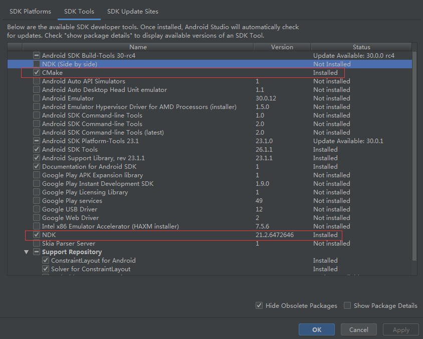
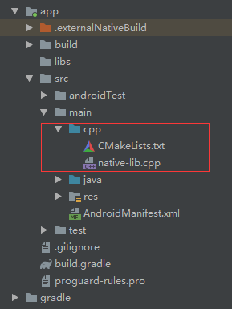

# NDK

参考 [Android开发者NDK](https://developer.android.google.cn/ndk/guides?hl=zh-cn)

原生开发套件 (NDK) 是一套工具，使您能够在 Android 应用中使用 C 和 C++ 代码，并提供众多[平台库](https://developer.android.google.cn/ndk/guides/stable_apis?hl=zh-cn)，您可使用这些平台库管理原生 Activity 和访问实体设备组件，例如传感器和轻触输入。

使用场景：

- 进一步提升设备性能，以降低延迟，或运行计算密集型应用，如游戏或物理模拟。
- 重复使用您自己或其他开发者的 C 或 C++ 库。

Android Studio 编译原生库的默认构建工具是 [CMake](https://cmake.org/)，可以不再使用ndk-build 编译工具包。

## 1.安装及配置 NDK 和 CMake

在 **SDK Manager** 中下载、安装NDK和CMake。



也可以安装特定版本的 NDK，勾选右下角 **Show Package Details** 。

## 2.创建支持 C/C++ 的新项目

创建项目和创建正常Android项目差不多，模版里选择 **Native C++** 即可。

## 3.现有项目添加 C 和 C++ 代码

1. 新建 **cpp** 目录；
2. 将 C++ 源文件放到该目录；
3. 配置 **CMake** 文件，并将该文件路径配置到 Gradle 。



### 3.1 配置CMake文件

CMake 构建脚本是一个纯文本文件，您必须将其命名为 `CMakeLists.txt`，并在其中包含 CMake 构建您的 C/C++ 库时需要使用的命令。

其中有几项必须配置：

`cmake_minimum_required` :设置最低版本，现在写 `VERSION 3.4.1`；

`add_library`：创建并命名库的名称，并关联相应的文件，为了让 CMake 能够在编译时找到头文件，您需要向 CMake 构建脚本添加 `include_directories()`。

完整示例：

```cmake
# Sets the minimum version of CMake required to build your native library.
    # This ensures that a certain set of CMake features is available to
    # your build.

    cmake_minimum_required(VERSION 3.4.1)

    # Specifies a library name, specifies whether the library is STATIC or
    # SHARED, and provides relative paths to the source code. You can
    # define multiple libraries by adding multiple add_library() commands,
    # and CMake builds them for you. When you build your app, Gradle
    # automatically packages shared libraries with your APK.

    add_library( # Specifies the name of the library.
                 native-lib

                 # Sets the library as a shared library.
                 SHARED

                 # Provides a relative path to your source file(s).
                 src/main/cpp/native-lib.cpp )
                 
     # Specifies a path to native header files.
    include_directories(src/main/cpp/include/)
```

其他可选配置：

`find_library`：找到 NDK 库并将其路径存储为一个变量。

举例：

```cmake
# Searches for a specified prebuilt library and stores the path as a
# variable. Because CMake includes system libraries in the search path by
# default, you only need to specify the name of the public NDK library
# you want to add. CMake verifies that the library exists before
# completing its build.

find_library( # Sets the name of the path variable.
              log-lib

              # Specifies the name of the NDK library that
              # you want CMake to locate.
              log )

# Specifies libraries CMake should link to your target library. You
# can link multiple libraries, such as libraries you define in this
# build script, prebuilt third-party libraries, or system libraries.

target_link_libraries( # Specifies the target library.
                       native-lib

                       # Links the target library to the log library
                       # included in the NDK.
                       ${log-lib} )
```

### 3.2 配置gradle

在gradle文件中配置 CMake 文件的路径。

```groovy
android {
    ...
    externalNativeBuild {
        cmake {
            path "src/main/cpp/CMakeLists.txt"
            version "3.10.2"
        }
    }
    ...
}
```

## 4.Native 接口

C++ 中函数定义

```c++
#include <jni.h>
#include <string>

// Java_{文件完整路径名.换成_}_函数名
// 返回值使用j开头对应Java中的基本数据类型
// env 是结构体指针，有很对方法可以调用
// this 是调用Java函数的对象
extern "C" JNIEXPORT jstring JNICALL
Java_com_ren_examplec_MainActivity_stringFromJNI(JNIEnv* env, jobject /* this */) {
    std::string hello = "Hello from C++";
    return env->NewStringUTF(hello.c_str());
}
```

Java调用

```java
package com.ren.examplec;

import androidx.appcompat.app.AppCompatActivity;

import android.os.Bundle;
import android.widget.TextView;

public class MainActivity extends AppCompatActivity {

    // Used to load the 'native-lib' library on application startup.
    static {
        System.loadLibrary("native-lib");
    }

    @Override
    protected void onCreate(Bundle savedInstanceState) {
        super.onCreate(savedInstanceState);
        setContentView(R.layout.activity_main);

        // Example of a call to a native method
        TextView tv = findViewById(R.id.sample_text);
        tv.setText(stringFromJNI());
    }

    /**
     * A native method that is implemented by the 'native-lib' native library,
     * which is packaged with this application.
     */
    public native String stringFromJNI();
    
}
```

## 5. 指定ndk编译的abi

```groovy
defaultConfig {
    ndk {
        abiFilters "armeabi", "armeabi-v7a", "x86"
    }
}
```

