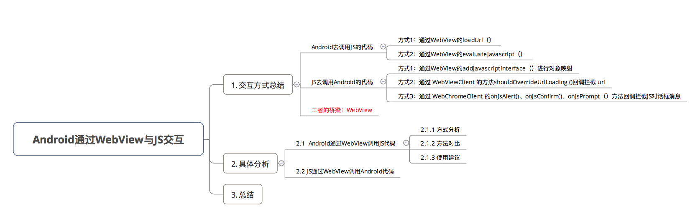

# WebView与JS交互



## JS调用Android

对于JS调用Android代码的方法有3种：

- 通过WebView的`addJavascriptInterface()`进行对象映射
- 通过 WebViewClient 的`shouldOverrideUrlLoading()`方法回调拦截 url
- 通过 WebChromeClient 的`onJsAlert()`、`onJsConfirm()`、`onJsPrompt()`方法回调拦截JS对话框`alert()`、`confirm()`、`prompt()` 消息

### 1.addJavascriptInterface

Android代码

```java 
public class AnnouncementDlg{
    ...
    WebView webView = (WebView) view.findViewById(ResourceUtil.getId("web_view_announcement"));
    webView.addJavascriptInterface(this, "dybJs");
    WebSettings settings = webView.getSettings();
    settings.setJavaScriptEnabled(true);
    // 加载JS代码
    // 格式规定为:file:///android_asset/文件名.html
    webView.loadUrl("file:///android_asset/javascript.html");
    ...
    /**
    * 关闭弹窗
    */
    @JavascriptInterface
    public void onDialogClose() {
        dismiss();
    }
    ...
}

```

JS调用

```html
<!DOCTYPE html>
<html>
   <head>
      <meta charset="utf-8">
      <title>Test</title>  
      <script>
        function callAndroid() {
            dybJs.onDialogClose();
        }
      </script>
   </head>
   <body>
      <!-- 点击按钮则调用callAndroid函数 -->
      <button type="button" id="button1" onclick="callAndroid()"></button>
   </body>
</html>
```

其他以后再补充

## 参考

https://www.jianshu.com/p/3c94ae673e2a

https://www.jianshu.com/p/345f4d8a5cfa

https://www.jianshu.com/p/3a345d27cd42