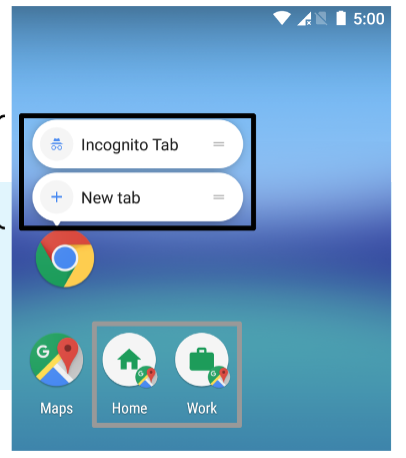

# 快捷方式

快捷方式可帮助用户快速访问部分应用，从而为用户提供特定类型的内容。与IOS类似，长按图标可以显示功能。最多可以创建四个。



## 创建

1.在 *AndroidManifest.xml* 中添加 `meta-data`

```xml
<manifest xmlns:android="http://schemas.android.com/apk/res/android"
          package="com.example.myapplication">
  <application ... >
    <activity android:name="Main">
      <intent-filter>
        <action android:name="android.intent.action.MAIN" />
        <category android:name="android.intent.category.LAUNCHER" />
      </intent-filter>
      
      <meta-data android:name="android.app.shortcuts"
                 android:resource="@xml/shortcuts" /> 
    </activity>
  </application>
</manifest>
```

2.添加 *res/xml/shortcuts.xml*

```xml
<shortcuts xmlns:android="http://schemas.android.com/apk/res/android">
  <shortcut
    android:shortcutId="compose"
    android:enabled="true"
    android:icon="@drawable/compose_icon"
    android:shortcutShortLabel="@string/compose_shortcut_short_label1"
    android:shortcutLongLabel="@string/compose_shortcut_long_label1"
    android:shortcutDisabledMessage="@string/compose_disabled_message1">
    <intent
      android:action="android.intent.action.VIEW"
      android:targetPackage="com.example.myapplication"
      android:targetClass="com.example.myapplication.ComposeActivity" />
    <!-- If your shortcut is associated with multiple intents, include them
         here. The last intent in the list determines what the user sees when
         they launch this shortcut. -->
    <categories android:name="android.shortcut.conversation" />
  </shortcut>
  <!-- Specify more shortcuts here. -->
</shortcuts>
```

> 还有一种**固定快捷方式**(如上图的下半部分)，在Android 8.0 (API level 26) 以上可以使用，用得很少就不写了。