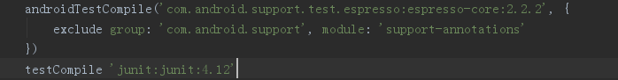

# 测试

Android中的单元测试基于JUnit，可分为**本地测试**和**instrumented测试**

## 1 对应目录

| 目录 | 特点 |
|------|-----|
| `module-name/src/test/java/` | 该目录下的代码运行在本地JVM上，其优点是速度快，不需要设备或模拟器的支持，但是无法直接运行含有android系统API引用的测试代码 |
| `module-name/src/androidTest/java/` | 该目录下的测试代码需要运行在android设备或模拟器下面，因此可以使用android系统的API，速度较慢 |

## 2 常用的测试框架

- JUnit4：本地调用JVM，速度快，无法调用Android系统API
- AndroidJUnitRunner：无法在本地JVM运行，直接的结果就是测试速度慢，同时无法执行覆盖测试
- Mockito：可以在本地执行测试，同事调用Android系统API
- Espresso：UI测试框架，但是现在的APP很多使用网页形式，所以使用场景不多

## 3 Espresso

UI自动化框架

新建工程时会自动加上依赖项



在 androidTest/java/{包名} 目录下新建文件

举例：

```java
import org.junit.Before;
import org.junit.Rule;
import org.junit.Test;
import org.junit.runner.RunWith;

import androidx.test.rule.ActivityTestRule;
import androidx.test.runner.AndroidJUnit4;

@RunWith(AndroidJUnit4.class)
@LargeTest
public class ChangeTextBehaviorTest {

    private String stringToBetyped;

    @Rule
    public ActivityTestRule<MainActivity> activityRule
            = new ActivityTestRule<>(MainActivity.class);

    @Before
    public void initValidString() {
        // Specify a valid string.
        stringToBetyped = "Espresso";
    }

    @Test
    public void changeText_sameActivity() {
        // Type text and then press the button.
        onView(withId(R.id.editTextUserInput))
                .perform(typeText(stringToBetyped), closeSoftKeyboard());
        onView(withId(R.id.changeTextBt)).perform(click());

        // Check that the text was changed.
        onView(withId(R.id.textToBeChanged))
                .check(matches(withText(stringToBetyped)));
    }
}
```

### 匹配View

```java
// 使用文字
onView(withText("Sign-in"));
// 使用ID
onView(withId(R.id.button_signin));
// 多重匹配
onView(allOf(withId(R.id.button_signin), withText("Sign-in")));
onView(allOf(withId(R.id.button_signin), not(withText("Sign-out"))));
```

### 测试数据

```java
onData(allOf(is(instanceOf(Map.class)),
        hasEntry(equalTo(LongListActivity.ROW_TEXT), is("test input"))));
```

### 动作

通过 `perform()` 函数，参数有很多动作，比如点击、输入文本、滑动等等，参考 [ViewAction](https://developer.android.google.cn/reference/androidx/test/espresso/action/ViewActions.html?hl=zh-cn)

## 4 单元测试

分三种：

- 依赖Android框架：Robolectric
- 极小依赖：Mockito
- 不依赖Android框架：JUnit4

### 4.1 JUnit4

对Android框架没有依赖，纯Java代码，比如验证数据格式等。

最简单的方法就是打开类文件，按 `Ctrl + Shitf + T` ，创建测试类。

JUnit4 只需要在类的方法声明 `@Test` 就可以了，不用以Test开头之类的。

依赖：(一般创建Android工程都会默认创建)

    testImplementation 'junit:junit:4.12'

举例：

```java
package com.ryw.myservice;

import org.junit.Test;

public class JsonDecryptTest {

    @Test
    public void decrypt() {
        String json = "{\"a\": \"1\"}";
        JsonDecrypt jsonDecrypt = new JsonDecrypt(json);
    }
}
```

### 4.2 Mockito

模拟外部依赖。制作依赖替身。

依赖：

    testImplementation "org.mockito:mockito-core:+"
    androidTestImplementation "org.mockito:mockito-android:+" // 对Android原生支持，暂时不知道有什么用

举例：

```java
import android.content.SharedPreferences;

import org.junit.Before;
import org.junit.Test;
import org.junit.runner.RunWith;
import org.mockito.Mock;
import org.mockito.junit.MockitoJUnitRunner;

import static org.hamcrest.MatcherAssert.assertThat;
import static org.hamcrest.CoreMatchers.*;
import static org.mockito.Mockito.*;

// 依赖MockitoJUnitRunner.class
@RunWith(MockitoJUnitRunner.class)
public class MyTest {

    // Mcck的对象
    @Mock
    SharedPreferences sharedPreferences;

    
    @Before
    public void setup() {
        // 设置对象方法的返回值
        // 当调用contains方法时(参数为任意字符串)，都返回false
        when(sharedPreferences.contains(anyString())).thenReturn(false);
    }

    // 测试方法
    @Test
    public void myTest() {
        // 断言contains方法是否返回false
        assertThat(sharedPreferences.contains("name"), is(false));
    }
}

```

局限：

正是由于Mockito生成mock对象的原理是基于CGLIB，而CGLIB生成代理对象有其局限性，如final类型、private类型以及静态类型的方法不能mock。但是在我们项目中，如果要对静态方法或者final方法进行单元测试，那该怎么办呢？

使用 **PowerMockito** 。

### 4.3 Robolectric

Robolectric 在本地 JVM 或真实设备上执行真实的 Android 框架代码和原生框架代码的虚假对象。

Robolectric通过实现一套JVM能运行的Android代码，然后在unit test运行的时候去截取android相关的代码调用，然后转到自己实现的代码去执行这个调用的过程。

依赖：

在Androidx中已经默认集成了，不需要额外设置。

app/build.gradle

```
 android {
    // ...
    testOptions {
        unitTests.includeAndroidResources = true
    }
}
```

未完待续...