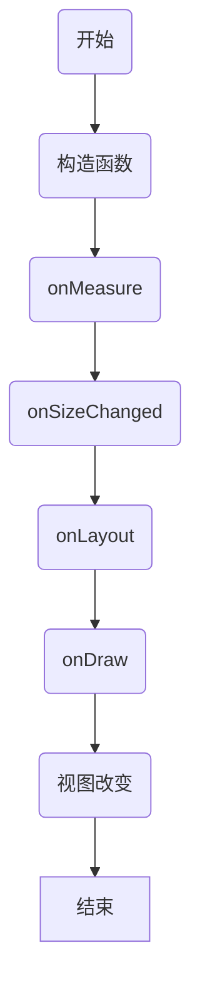
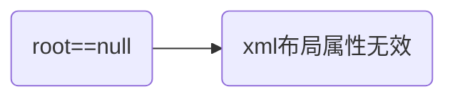
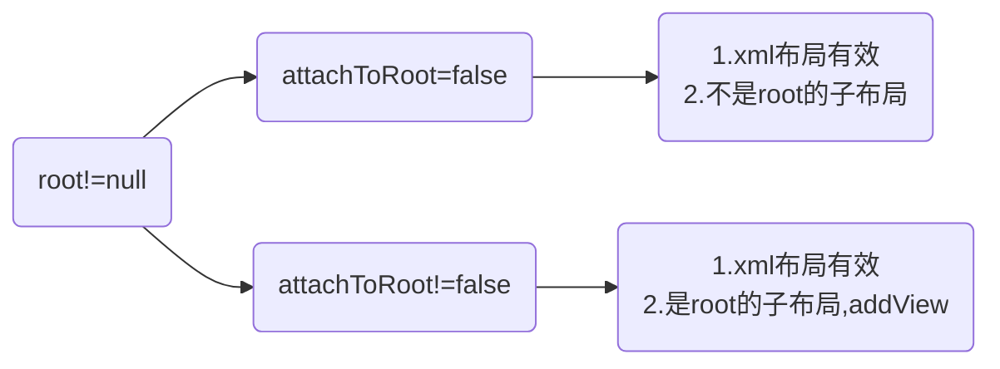

# 自定义视图

有三种方法可以自定义视图

## 完全定制的组件

1. 扩展的最通用的视图 `View`
2. 提供一个可以从XML获取属性和参数的构造函数
3. 创建事件侦听器，属性访问器和修改器
4. 重写 `onMeasure()` 以及 `onDraw()`或者其他方法

生命周期:



## 复合控制

要创建复合组件：

1. 通常的起点是某种布局，因此创建一个扩展布局的类。也许在组合框的情况下，我们可能使用具有水平方向的`LinearLayout`。请记住，其他布局可以嵌套在内部，因此复合组件可以是任意复杂和结构化的。请注意，就像使用Activity一样，您可以使用声明式（基于XML）方法来创建包含的组件，也可以从代码中以编程方式嵌套它们。
2. 在新类的构造函数中，获取超类所需的任何参数，并首先将它们传递给超类构造函数。然后，您可以设置其他视图以在新组件中使用; 这是您创建`EditText`字段和`PopupList`的位置。请注意，您还可以将自己的属性和参数引入到XML中，这些属性和参数可以由构造函数提取和使用。
3. 您还可以为包含的视图可能生成的事件创建侦听器，例如，`List Item`的侦听器方法单击Listener以在创建列表时更新EditText的内容。
4. 您也可以使用访问器和修饰符创建自己的属性，例如，允许在组件中最初设置EditText值，并在需要时查询其内容。
5. 在扩展布局的情况下，您不需要覆盖 `onDraw()`和`onMeasure()`方法，因为布局将具有可能正常工作的默认行为。但是，如果需要，您仍然可以覆盖它们。
6. 您可以覆盖其他on...方法，例如 `onKeyDown()`，当按下某个键时，可能从组合框的弹出列表中选择某些默认值。

> 这一部分官网讲得不详细，完全自定义组件的情况很少，复合控制的情况比较常见

## Inflate 解析过程

源码：

```java
/**
     * Inflate a new view hierarchy from the specified XML node. Throws
     * {@link InflateException} if there is an error.
     * <p>
     * <em><strong>Important</strong></em>&nbsp;&nbsp;&nbsp;For performance
     * reasons, view inflation relies heavily on pre-processing of XML files
     * that is done at build time. Therefore, it is not currently possible to
     * use LayoutInflater with an XmlPullParser over a plain XML file at runtime.
     *
     * @param parser XML dom node containing the description of the view
     *        hierarchy.
     * @param root Optional view to be the parent of the generated hierarchy (if
     *        <em>attachToRoot</em> is true), or else simply an object that
     *        provides a set of LayoutParams values for root of the returned
     *        hierarchy (if <em>attachToRoot</em> is false.)
     * @param attachToRoot Whether the inflated hierarchy should be attached to
     *        the root parameter? If false, root is only used to create the
     *        correct subclass of LayoutParams for the root view in the XML.
     * @return The root View of the inflated hierarchy. If root was supplied and
     *         attachToRoot is true, this is root; otherwise it is the root of
     *         the inflated XML file.
     */
    public View inflate(XmlPullParser parser, @Nullable ViewGroup root, boolean attachToRoot) {
        synchronized (mConstructorArgs) {
            Trace.traceBegin(Trace.TRACE_TAG_VIEW, "inflate");

            final Context inflaterContext = mContext;
            final AttributeSet attrs = Xml.asAttributeSet(parser);
            Context lastContext = (Context) mConstructorArgs[0];
            mConstructorArgs[0] = inflaterContext;
            View result = root;

            try {
                advanceToRootNode(parser);
                final String name = parser.getName();

                if (DEBUG) {
                    System.out.println("**************************");
                    System.out.println("Creating root view: "
                            + name);
                    System.out.println("**************************");
                }

                if (TAG_MERGE.equals(name)) {
                    if (root == null || !attachToRoot) {
                        throw new InflateException("<merge /> can be used only with a valid "
                                + "ViewGroup root and attachToRoot=true");
                    }

                    rInflate(parser, root, inflaterContext, attrs, false);
                } else {
                    // Temp is the root view that was found in the xml
                    final View temp = createViewFromTag(root, name, inflaterContext, attrs);

                    ViewGroup.LayoutParams params = null;

                    if (root != null) {
                        if (DEBUG) {
                            System.out.println("Creating params from root: " +
                                    root);
                        }
                        // Create layout params that match root, if supplied
                        params = root.generateLayoutParams(attrs);
                        if (!attachToRoot) {
                            // Set the layout params for temp if we are not
                            // attaching. (If we are, we use addView, below)
                            temp.setLayoutParams(params);
                        }
                    }

                    if (DEBUG) {
                        System.out.println("-----> start inflating children");
                    }

                    // Inflate all children under temp against its context.
                    rInflateChildren(parser, temp, attrs, true);

                    if (DEBUG) {
                        System.out.println("-----> done inflating children");
                    }

                    // We are supposed to attach all the views we found (int temp)
                    // to root. Do that now.
                    if (root != null && attachToRoot) {
                        root.addView(temp, params);
                    }

                    // Decide whether to return the root that was passed in or the
                    // top view found in xml.
                    if (root == null || !attachToRoot) {
                        result = temp;
                    }
                }

            } catch (XmlPullParserException e) {
                final InflateException ie = new InflateException(e.getMessage(), e);
                ie.setStackTrace(EMPTY_STACK_TRACE);
                throw ie;
            } catch (Exception e) {
                final InflateException ie = new InflateException(
                        getParserStateDescription(inflaterContext, attrs)
                        + ": " + e.getMessage(), e);
                ie.setStackTrace(EMPTY_STACK_TRACE);
                throw ie;
            } finally {
                // Don't retain static reference on context.
                mConstructorArgs[0] = lastContext;
                mConstructorArgs[1] = null;

                Trace.traceEnd(Trace.TRACE_TAG_VIEW);
            }

            return result;
        }
    }
```

流程：





