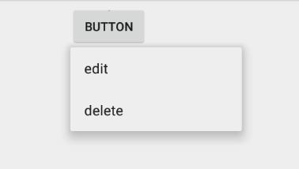

# 菜单

有三种方式：

- 选项菜单和应用栏
- 上下文菜单和上下文操作模式: 长按某一元素时出现的浮动菜单
- 弹出菜单：以垂直列表形式显示一系列项目,这些项目将锚定到调用该菜单的视图中

## 使用 XML 定义菜单

项目 res/menu/ 目录内创建一个 XML 文件

```xml
<?xml version="1.0" encoding="utf-8"?>
<menu xmlns:android="http://schemas.android.com/apk/res/android">
    <item android:id="@+id/new_game"
          android:icon="@drawable/ic_new_game"
          android:title="@string/new_game"
          android:showAsAction="ifRoom"/>
    <item android:id="@+id/help"
          android:icon="@drawable/ic_help"
          android:title="@string/help" />
</menu>
```

## 创建选项菜单

参考 `ActionBar` 章节

## 创建上下文菜单

1.通过调用 `registerForContextMenu()`，注册应与上下文菜单关联的 `View`

如果 Activity 使用 ListView 或 GridView 且您希望每个项目均提供相同的上下文菜单，请通过将 ListView 或 GridView 传递给 registerForContextMenu()，为上下文菜单注册所有项目。貌似 `recycleView` 不行

2.在 Activity 或 Fragment 中实现 `onCreateContextMenu()`

当注册后的视图收到**长按事件**时，系统将调用您的 `onCreateContextMenu()` 方法

```java
@Override
public void onCreateContextMenu(ContextMenu menu, View v,
                                ContextMenuInfo menuInfo) {
    super.onCreateContextMenu(menu, v, menuInfo);
    MenuInflater inflater = getMenuInflater();
    inflater.inflate(R.menu.context_menu, menu);
}
```
3.实现 `onContextItemSelected()`

```java
@Override
public boolean onContextItemSelected(MenuItem item) {
    AdapterContextMenuInfo info = (AdapterContextMenuInfo) item.getMenuInfo();
    switch (item.getItemId()) {
        case R.id.edit:
            editNote(info.id);
            return true;
        case R.id.delete:
            deleteNote(info.id);
            return true;
        default:
            return super.onContextItemSelected(item);
    }
}
```


## 创建弹出菜单

PopupMenu 是锚定到 View 的模态菜单

1. 实例化 `PopupMenu` 及其构造函数，该函数将提取当前应用的 `Context` 以及菜单应锚定到的 View
2. 使用 `MenuInflater` 将菜单资源扩充到 `PopupMenu.getMenu()` 返回的 Menu 对象中
3. 调用 `PopupMenu.show()`

举例：

```java
    public void onClick(View view) {
        PopupMenu popup = new PopupMenu(this, view);
        popup.inflate(R.menu.select_item);
        popup.setOnMenuItemClickListener(new PopupMenu.OnMenuItemClickListener() {
            @Override
            public boolean onMenuItemClick(MenuItem item) {
                switch (item.getItemId()) {
                    case R.id.action_edit:
                        return true;
                    case R.id.action_delete:
                        return true;
                    default:
                        return false;
                }
            }
        });
        popup.show();
    }
```

