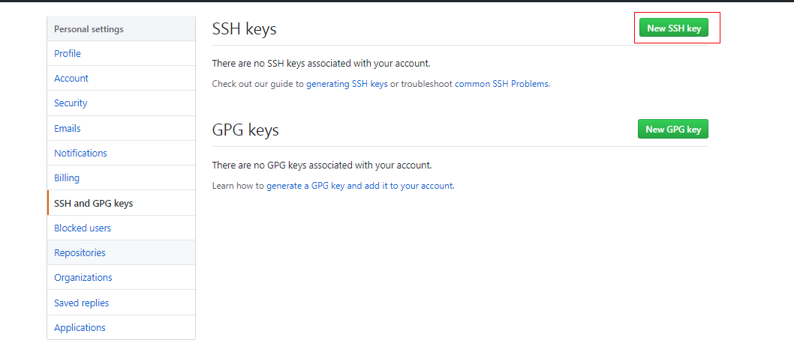

- [使用ssh协议连接git仓库](#%E4%BD%BF%E7%94%A8ssh%E5%8D%8F%E8%AE%AE%E8%BF%9E%E6%8E%A5git%E4%BB%93%E5%BA%93)
  - [1.1 检查现有的SSH密钥](#11-%E6%A3%80%E6%9F%A5%E7%8E%B0%E6%9C%89%E7%9A%84SSH%E5%AF%86%E9%92%A5)
  - [1.2 生成新的SSH密钥](#12-%E7%94%9F%E6%88%90%E6%96%B0%E7%9A%84SSH%E5%AF%86%E9%92%A5)
  - [1.3 将SSH密钥添加到到 GitHub 帐户](#13-%E5%B0%86SSH%E5%AF%86%E9%92%A5%E6%B7%BB%E5%8A%A0%E5%88%B0%E5%88%B0-GitHub-%E5%B8%90%E6%88%B7)

# 使用ssh协议连接git仓库

我们可以使用SSH协议连接和验证远程服务器和服务。使用SSH密钥的好处是在每次访问时无需提供用户名或密码即可连接到GitHub。

## 1.1 检查现有的SSH密钥

在生成SSH密钥之前，您可以检查是否有任何现有的SSH密钥。

    ls -al ~/.ssh

> Windows目录：`C:\Users\Administrator\.ssh`

如果有以下任意文件则表示SSH公钥

- id_dsa.pub
- id_ecdsa.pub
- id_ed25519.pub
- id_rsa.pub

相同文件名而不带后缀名(`.pub`)的是私钥

比如：*id_rsa* 和 *id_ras.pub*是一对密钥

如果没有公钥和私钥对，或者不希望使用任何可用的连接到GitHub，则参考 [1.2 生成新的SSH密钥](#12-%E7%94%9F%E6%88%90%E6%96%B0%E7%9A%84SSH%E5%AF%86%E9%92%A5)

如果已经有了，参考 [1.3 将SSH密钥添加到到 GitHub 帐户](#13-%E5%B0%86SSH%E5%AF%86%E9%92%A5%E6%B7%BB%E5%8A%A0%E5%88%B0%E5%88%B0-GitHub-%E5%B8%90%E6%88%B7)

## 1.2 生成新的SSH密钥

运行

    ssh-keygen

Linux/Mac 系统中，`ssh-keygen` 随 SSH 软件包提供

在 Windows 上，该程序包含于 MSysGit 软件包中，也就是git-bash

1. 首先 ssh-keygen 会确认密钥的存储位置（默认是 `.ssh/id_rsa`），直接回车
2. 然后它会要求你输入两次密钥口令，也可以直接回车

## 1.3 将SSH密钥添加到到 GitHub 帐户

一句话：复制 公钥(.pub) 的文件内容到github后台

公钥看起来是这样的

```
ssh-rsa AAAAB3NzaC1yc2EAAAADAQABAAABAQDdT1V8FzWCzwt4Jtj6Vk2ZkrJfWfLJW3883uHKWOKgJX82wLPcPRLT7EvKJPme16BeqgC0vK/wtfBAAJh7YWWYWomcoK+28pGBKcb8ZJsXZmXcL2JUECrP55Pcxb30pU9JJR9KQxAHZnl3symKYRUewhDfDsF+AH5q4FSF7L2+ThpsXqdlXijChuu0mgLdtg2iVKvYw5Ed0W7TZOOnYexq8DHbT69KywHi2kkmnts9ZCEI9o+R33KWa3gggXFt7aH6yDZr/mbAUbv1/Tqw2HH0l1A+Zqfbp8cB4VmrgkM8vuHnnyJSB+1QdIANBuacFQcuqc56VqJZimb5xUCLLHDB 18673298768@163.com
```



大功告成，可以使用SSH协议推送代码到仓库了

本文参考 [生成 SSH 公钥](https://git-scm.com/book/zh/v2/%E6%9C%8D%E5%8A%A1%E5%99%A8%E4%B8%8A%E7%9A%84-Git-%E7%94%9F%E6%88%90-SSH-%E5%85%AC%E9%92%A5) 和 [使用 SSH 连接到 GitHub](https://help.github.com/cn/articles/connecting-to-github-with-ssh)