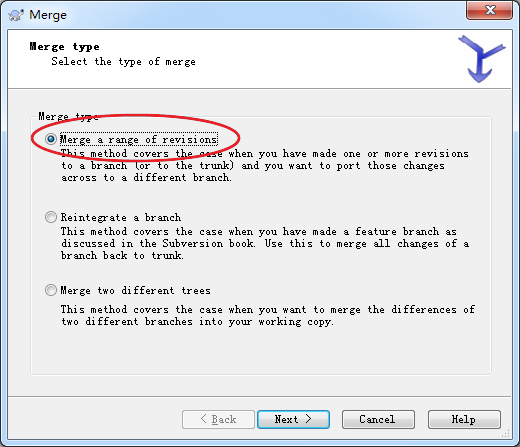
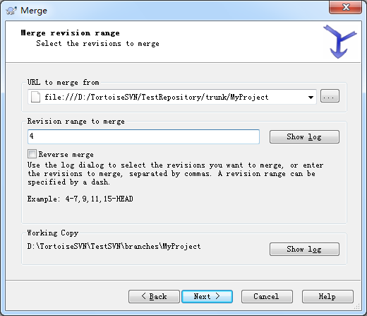

# svn分支操作

创建代码仓库后，我们一般在仓库里创建trunk、branches、tags这三个文件夹，而不是直接提交。

- `trunk`: 主干,我们一般把项目提交到此文件夹里面,在trunk中开发。
- `branches`:分支，我们一般把那些需要打分支,但是有可能会修改的项目代码，打分支到此目录。
- `tags`:分支，我们一般把那些阶段性(如迭代各期)的项目代码,打分支到此目录。

## 创建 `branches`

在 `/trunk/MyProject` 目录上右键，依次选择 `"TortoiseSVN" -> "Branch/tag..."` ，在弹出窗口的 `"To URL"` 中填入分支的地址（注意是仓库的地址而不是本地）

## Check out分支

右键TestSVN目录选择 `TortoiseSVN Update` 即可将刚刚建立的分支下载回本地

## 合并

### 将trunk同步到branch

先保证trunk已经完全同步，然后在`/branches/MyProject`上右键，依次选择`TortoiseSVN" -> “Merge...`，在弹出的窗口中选择第一项 `Merge a range of revision`，该选项适用于将分支或者主干上提交的变化合并到另一分支。

点击 Next，在弹出窗口的 `URL to merge from` 填入 `trunk`的路径（注意是仓库中的路径）

### 将branch同步到trank

同理，在 `trunk` 目录右键，`URL to merge from`填入 `branches` 的路径即可（也是仓库中的路径）

要注意的地方：

- TortoiseSVN的合并发生在本地，也即你的working copy中，你无需过多担心会对repository中的代码造成影响
- 不管是从trunk合并到branch还是最终从branch合并回trunk，在每次合并前最好先update，然后将本地的修改先全部commit，保护好现场，万一合并不理想随时都可以revert
- 合并完成后看是否能正确编译，然后测试验证，最后将合并后的改动提交到repository

总结：svn分支操作就是这些，很常用，但也需要熟练掌握哟