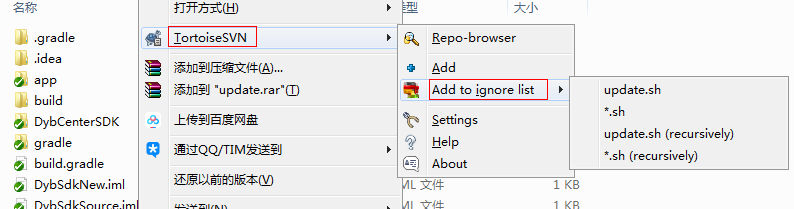
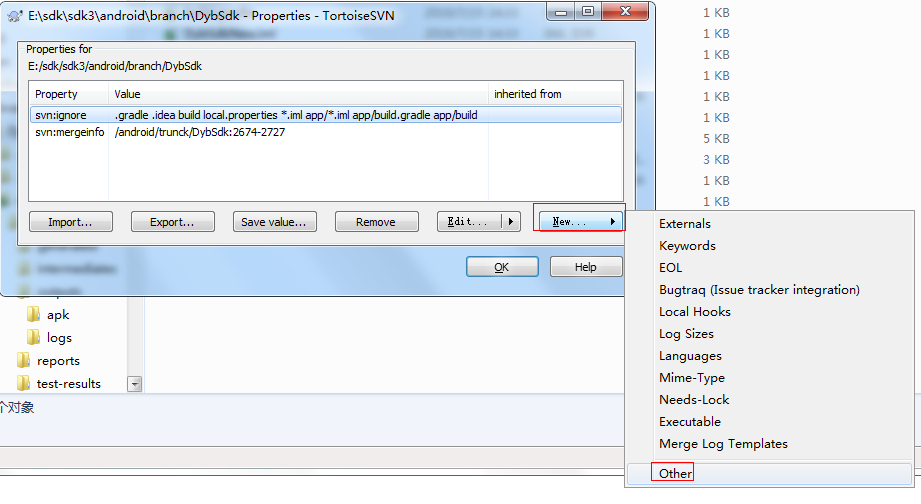
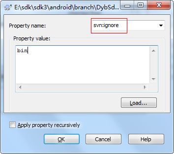

# SVN添加忽略文件

git中忽略文件有 `.gitigore`文件，但是svn里好像没有，其实也可以配置

## 右键Add to ignore list方式

右键 `TortoiseSVN -> Add to ignore list -> Library` 或 `Library(recursively)`，选择Library表示只忽略Library目录，而Library(recursively)表示Library目录及其子目录都忽略，实际测试时两种方式都选过，没看到有什么差异。



## Properties中添加的方式

如果有多个路径可以使用Properties的方式

在工作目录的空白处右键 `TortoiseSVN -> Properties`，然后选择 `New -> Other`，选择 `svn:ignore`，输入要忽略的文件以及文件名、





## Android项目忽略规则

### AndroidStudio

```
.gradle
.idea
build
local.properties
*.iml
app/*.iml
app/build.gradle
app/build
```

### Eclipse

```
bin
gen
local.properties
...
```

我们可以将配置保存成两个文件 `AndroidStudioIgnore` 和 `EclipseIgnore` 文件，下次直接导入。

## 添加全局忽略

就不用每个工程配置了。

找到 *C:\Users\Administrator\AppData\Roaming\Subversion\config* 文件，搜索 **global-ignores**，就是全局忽略配置。