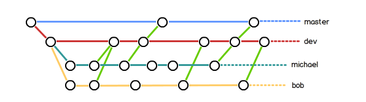

# 基础

## 1 汇总

```
λ git --help
usage: git [--version] [--help] [-C <path>] [-c name=value]
           [--exec-path[=<path>]] [--html-path] [--man-path] [--info-path]
           [-p | --paginate | --no-pager] [--no-replace-objects] [--bare]
           [--git-dir=<path>] [--work-tree=<path>] [--namespace=<name>]
           <command> [<args>]

These are common Git commands used in various situations:

start a working area (see also: git help tutorial)
   clone      Clone a repository into a new directory
   init       Create an empty Git repository or reinitialize an existing one

work on the current change (see also: git help everyday)
   add        Add file contents to the index
   mv         Move or rename a file, a directory, or a symlink
   reset      Reset current HEAD to the specified state
   rm         Remove files from the working tree and from the index

examine the history and state (see also: git help revisions)
   bisect     Use binary search to find the commit that introduced a bug
   grep       Print lines matching a pattern
   log        Show commit logs
   show       Show various types of objects
   status     Show the working tree status

grow, mark and tweak your common history
   branch     List, create, or delete branches
   checkout   Switch branches or restore working tree files
   commit     Record changes to the repository
   diff       Show changes between commits, commit and working tree, etc
   merge      Join two or more development histories together
   rebase     Reapply commits on top of another base tip
   tag        Create, list, delete or verify a tag object signed with GPG

collaborate (see also: git help workflows)
   fetch      Download objects and refs from another repository
   pull       Fetch from and integrate with another repository or a local branch
   push       Update remote refs along with associated objects

'git help -a' and 'git help -g' list available subcommands and some
concept guides. See 'git help <command>' or 'git help <concept>'
to read about a specific subcommand or concept.
```

## 2 常用命令说明

### 2.1 clone

克隆仓库到新目录

举例：

```
$ git clone git@github.com:michaelliao/gitskills.git
Cloning into 'gitskills'...
remote: Counting objects: 3, done.
remote: Total 3 (delta 0), reused 0 (delta 0)
Receiving objects: 100% (3/3), done.
```

创建 *gitsills* 目录，并将代码克隆进去。

### 2.2 init

创建新的仓库或者重新初始化仓库。

举例：

```
λ git init
Initialized empty Git repository in F:/下载/MobileFile/.git/
```

### 2.3 status

显示工作树的状态。

举例：

```bash
λ git status
warning: LF will be replaced by CRLF in startup.sh.
The file will have its original line endings in your working directory.
On branch master
Changes to be committed:
  (use "git reset HEAD <file>..." to unstage)

        deleted:    nohup.out
        modified:   startup.sh
        modified:   static/drag.js
        modified:   static/params.js
        modified:   utils.go

Changes not staged for commit:
  (use "git add <file>..." to update what will be committed)
  (use "git checkout -- <file>..." to discard changes in working directory)

        modified:   FltxWeb

Untracked files:
  (use "git add <file>..." to include in what will be committed)

        .dockerignore
        dockerfile
        pack.sh


```

### 2.4 reset

既可以回退版本，也可以把暂存区的修改回退到工作区。

举例：

```
git reset HEAD readme.txt
Unstaged changes after reset:
M       readme.txt
```

`HEAD` 表示最新版本。

本条命令的含义是将暂存区的修改回退到工作区。

实际使用的时候都有提示：

```
λ git status
On branch master

Initial commit

Changes to be committed:
  (use "git rm --cached <file>..." to unstage)

        new file:   readme.txt

Changes not staged for commit:
  (use "git add <file>..." to update what will be committed)
  (use "git checkout -- <file>..." to discard changes in working directory)

        modified:   readme.txt
```

比如这个提示，可以使用 `git checkout -- readme.txt` 取消修改，恢复成和暂存区一致。

`checkout` 也可以将修改但没有添加到缓存区的文件恢复或者切换分支。

所以 `checkout` 命令应该把暂存区或者版本库里文件替换工作区的文件，有暂存区就用暂存区的替换，没有就用版本库里的。

### 2.5 remote

添加远程仓库。

使用：

```
git remote add <name> <url>
```

举例：

```
git remote add origin git@server-name:path/repo-name.git
```

`origin`是Git远程仓库默认叫法，也可以自己命令。

### 2.6 push

本地推送到远程仓库。

举例：

```
$ git push -u origin master
```

由于远程库是空的，我们第一次推送master分支时，加上了 `-u` 参数，Git不但会把本地的master分支内容推送的远程新的master分支，还会把本地的master分支和远程的master分支关联起来，在以后的推送或者拉取时就可以简化命令。

## 3 分支

### 3.1 创建分支

    $ git checkout -b <branch> <remote>/<branch>

举例：

```
λ git checkout -b dev
Switched to a new branch 'dev'
```

`-b`表示新建并切换分支

### 3.2 查看当前分支

```
$ git branch
* dev
  master
```

`*`表示当前分支

### 3.3 合并分支

将另一个分支与当前合并

    git merge <branch>

举例：

```
λ git merge dev
Updating 585aafe..0ce2263
Fast-forward
 mpFile/readme.txt | 1 +
 1 file changed, 1 insertion(+)
```

### 3.4 删除分支

    git branch (-d | -D) [-r] <branchname>…​

举例：

```
λ git branch -d dev
Deleted branch dev (was c1ad912).
```

> 注意：不能删除当前分支，必须切换到其他分支。

因为创建、合并和删除分支非常快，所以Git鼓励你使用分支完成某个任务，合并后再删掉分支，这和直接在master分支上工作效果是一样的，但过程更安全。

### 3.5 解决冲突

如果合并出现了冲突，如下：

```bash
λ git merge feat
Auto-merging mpFile/readme.txt
CONFLICT (content): Merge conflict in mpFile/readme.txt
Automatic merge failed; fix conflicts and then commit the result.

λ git status
On branch master
You have unmerged paths.
  (fix conflicts and run "git commit")

Unmerged paths:
  (use "git add <file>..." to mark resolution)

        both modified:   mpFile/readme.txt

no changes added to commit (use "git add" and/or "git commit -a")
```

那么需要手动解决冲突之后再提交。

这时文件已经变成：

```
λ cat mpFile\readme.txt
hello world
add something
add dev branch
add master
<<<<<<< HEAD
1+1
=======
add feat brach
>>>>>>> feat
```

Git用 `<<<<<<<` ，`=======`，`>>>>>>>` 标记出不同分支的内容。

手动更改后就可以提交，提交完成我们用 `git log --graph --pretty=oneline --abbrev-commit` 命令查看分支合并图。

### 3.6 分支管理策略

首先， master 分支应该是非常稳定的，也就是仅用来发布新版本，平时不能在上面干活；

那在哪干活呢？干活都在 `dev` 分支上，也就是说， `dev` 分支是不稳定的，到某个时候，比如1.0版本发布时，再把 `dev` 分支合并到 master 上，在 master 分支发布1.0版本；

你和你的小伙伴们每个人都在 `dev` 分支上干活，每个人都有自己的分支，时不时地往 `dev` 分支上合并就可以了。




本地开发的话，建议两个分支， `master` 和 `dev`， dev 用于日常开发，要是某个功能开发完成，就合并到 master 上，也可以打上标签，然后与远程仓库合并。这样就如果有冲突需要处理也不会影响到正在开发的代码。

### 3.7 bug分支