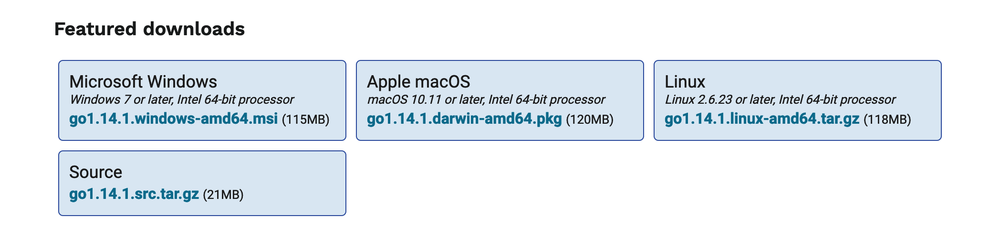

# VsCode配置Golang开发环境，基于Go Modules

本文参考 [从零开始搭建Go语言开发环境](https://www.liwenzhou.com/posts/Go/install_go_dev/)

之前都是使用 LiteIDE 开发Go，在IDE里就能设置任意 `GOPATH` 目录，挺方便。后来看到 VsCode 这么强大，也打算折腾一下。折腾一两个小时发现其实不算太麻烦。

Go语言1.14版本之后推荐使用Go Modules管理，所以我们可以在任何目录里建立Go项目。

总共三步：

1. 安装 Golang
2. 配置代理
3. 安装 VsCode 插件

## 1. 安装Golang

建议去官网下载安装，`Homebrew` 有时候很好用，不过有可能更新不及时，或者它自己无法更新，遇到问题还得再查，没必要。

Go官网下载地址：https://golang.org/dl/

Go官方镜像站（推荐）：https://golang.google.cn/dl/



注意 Windows 和 Mac 系统使用安装包安装完成后会自动在环境变量里添加 `GOROOT`和 `GOPATH`，我们不需要修改，而 Linux 系统需要自己设置。

安装好后检查是否安装成功：

```
➜ go version                            
go version go1.14.1 darwin/amd64
```

## 2. 配置代理

由于官方地址国内访问不了，所以我们先配置代理，这样才能下载插件和依赖。

执行命令：

    go env -w GOPROXY=https://goproxy.cn

## 安装 VsCode 插件

在插件列表里搜索 Go，安装即可。


在 VsCode 中打开任意目录，比如 examples，新建 *main.go*，就会提示安装 Go tools，点击安装。一般情况是超时无法安装，我们配置代理后都能安装成功。

## 第一个程序

在 *main.go* 里输入：

```go
package main

import (
	"fmt"
)

func main() {
	fmt.Println("hello", "world")
}
```

然后按F5，就能看到运行结果了。大功告成！

## 问题

1.提示 **You are neither in a module nor in your GOPATH**

在终端中初始化 Go Modules，输入：

    go mod init {项目名}

比如：

```
➜go mod init my_examples
go: creating new go.mod: module my_examples
```

其他问题以后再补充。