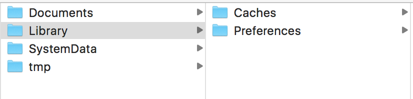

# UI开发

每一个界面都是一个View Controller，里面包含一个UIView，里面又包含了许多子控件。

## 1. UITextField 输入框

获取用户输入：

```objc
@property (weak, nonatomic) IBOutlet UITextField *text1;
NSString *num1 = self.text1.text;
```

将键盘叫回：

`[self.view endEditing:YES];`

在模拟器中使用 `cmd` + `K` 弹出键盘。

## 2. UIButton 按钮

```objc
// 移动图片
// 拖拽的时候选择uibutton，通过tag分辨不同的按钮
// 还可以通过改变 imgLoading.center,改变中心点位置
- (IBAction)moveImg:(UIButton *)sender {
    CGRect originRect = self.imgLoading.frame;
    switch (sender.tag) {
        case 1: // 上
            originRect.origin.y--;
            break;
        case 2: // 右
            originRect.origin.x++;
            break;
        case 3: // 下
            originRect.origin.y++;
            break;
        case 4: // 左
            originRect.origin.x--;
            break;
        default:
            break;
    }
    self.imgLoading.frame = originRect;
}
```

```objc
// 改变大小
// 还可以通过改变 imgLoading.bounds，改变边长
- (IBAction)scaleImg:(UIButton *)sender {
    CGRect originRect = self.imgLoading.frame;
    switch (sender.tag) {
        case 1: // 大
            originRect.size.height += 10;
            originRect.size.width += 10;
            break;
        case 2: // 小
            originRect.size.height -= 10;
            originRect.size.width -= 10;
            break;
        default:
            break;
    }
    self.imgLoading.frame = originRect;
}
```

**添加点击事件**

```objc
[btn addTarget:self action:@selector(btnClick) forControlEvents:UIControlEventTouchUpInside];

- (void) btnClick {
    NSLog(@"you click me");
}
```

## 3. 简单动画

### 3.1 方式一：头尾式(在iOS13上已经废弃)

```objc
// 开启动画
[UIView beginAnimations:nil context:nil];
// 设置动画时间
[UIView setAnimationDuration:2];
// 要执行的动作
self.imgLoading.frame = originRect;
// 提交
[UIView commitAnimations];
```

### 3.2 方式二：block式

```objc
 [UIView animateWithDuration:1 animations:^{
 				// 要执行的代码
        self.imgLoading.frame = originRect;
 }];
```

还有其他的API，以后自行查看。

## 4. 动态创建控件

```objc
UIButton *btn = [[UIButton alloc]initWithFrame:CGRectMake(16, 400, 50, 40)];
[btn setTitle:@"hello" forState:UIControlStateNormal];
[btn setTitleColor:UIColor.blackColor forState:UIControlStateNormal];
// 添加单击事件
[btn addTarget:self action:@selector(btnClick) forControlEvents:UIControlEventTouchUpInside];
// 添加到视图上
[self.view addSubview:btn];
```

单击执行的函数：

```objc
- (void) btnClick {
    NSLog(@"you click me");
}
```

## 5. 平移、旋转和缩放

```objc
// 平移
self.imgLoading.transform = 
CGAffineTransformTranslate(self.imgLoading.transform, 0, 10);
// 缩放，后面填倍数，现在是1.1倍
self.imgLoading.transform = CGAffineTransformScale(self.imgLoading.transform, 1.1, 1.1);
// 旋转，这里要填弧度，2π = 360°
// 可以用常量表示，M_PI_2 表示 90°
self.imgLoading.transform = CGAffineTransformRotate(self.imgLoading.transform, M_PI_2);
// 让控件回到原始状态
self.imgLoading.transform = CGAffineTransformIdentity;
```

## 6. xib 与 storyboard

两者都用于描述界面。xib轻量级，用于描述一个界面中的某个部分，后者用来描述多个界面以及跳转关系。

### 6.1 创建

1. 创建 **User Interface** 里的 **View**，确定，然后和storyboard一样操作控件；

2. 创建一个类 **MyUiView** 继承 **UIView**，并与xib关联；
3. 拖动xib里的子控件，在 **MyUiView** 里生成属性。

### 6.2 获取xib控件

```objc
// 找到应用程序的根目录
NSBundle *rootBundle = [NSBundle mainBundle];
// 获取对应的xib文件里的view
MyUiVIew *appView = [[rootBundle loadNibNamed:@"MyView" owner:nil options:nil] firstObject];
// 获取子控件并赋值
appView.myLabel.text = @"fadsfa";
```

> 一般情况不暴露子控件，而是提供具体的方法。

## 7.UILabel

```objc
UILabel *label = [[UILabel alloc] init];
// 设置圆角
label.layer.cornerRadius = 10;
// 裁剪多余的部分
label.layer.masksToBounds = YES;
```

## 8.UIScorllView

可以实现 "滚动" 和 "缩放"。基本设置和其他控件差不多，拖拽到ViewController 里面，设置其子控件。

步骤：

1. 拖拽ScrollView，设置全屏；
2. 拖拽ImageView到ScrollView，设置全屏、图片和大小(大小和图片相同)；
3. 设置ScrollView的内容，`self.scrollView.contentSize = self.imageView.frame.size;` 。

> 注意：ScrollView 和 ImageView 都要勾选 User Interaction Enabled。

```objc
#import "ViewController.h"
// 继承协议
@interface ViewController () <UIScrollViewDelegate>

@property (weak, nonatomic) IBOutlet UIScrollView *scrollView;
@property (weak, nonatomic) IBOutlet UIImageView *imageView;

@end

@implementation ViewController

//返回需要缩放的子视图
- (UIView *) viewForZoomingInScrollView:(UIScrollView *) scrollView {
    return self.imageView;
}

- (void)viewDidLoad {
    [super viewDidLoad];
    // 设置代理
    self.scrollView.delegatae = self;
    // 设置大小
    self.scrollView.contentSize = self.imageView.frame.size;
  	// 设置缩放
    self.scrollView.maximumZoomScale = 4;
    self.scrollView.minimumZoomScale = 0.2;
}

@end
```

## 9. 代理 (实现协议)

和 Android中的监听事件基本一致。前者实现接口，后者实现协议。

```objc
// 实现代理
@interface ScrollViewController () <UIScrollViewDelegate>

// 设置代理
- (void)viewDidLoad {
    [super viewDidLoad];
    // Do any additional setup after loading the view.
    self.scrollView.contentSize = self.imageView.frame.size;
    self.scrollView.delegate = self;
}

// 实现代理方法
- (void) scrollViewDidScroll:(UIScrollView *)scrollView {
    // 正在滑动
}

- (void) scrollViewWillBeginDragging:(UIScrollView *)scrollView {
    // 开始拖拽
}
```

## 10. 轮播图

用到 `UIScorllView` 和 `UIPageControl` 。

```objc
#import "ScrollViewController.h"

@interface ScrollViewController () <UIScrollViewDelegate>
@property (weak, nonatomic) IBOutlet UIScrollView *scrollView;
@property (weak, nonatomic) IBOutlet UIPageControl *pageControl;

@property (nonatomic, strong) NSTimer *timer;

@end

@implementation ScrollViewController

- (void)viewDidLoad {
    [super viewDidLoad];
    
    self.scrollView.delegate = self;
    CGFloat imgW = 343;
    CGFloat imgH = 130;
    CGFloat imgY = 0;
    
    // 将图片添加到ScrollView
    for (int i=0; i<4; i++) {
        UIImageView *imageView = [[UIImageView alloc] init];
        imageView.frame = CGRectMake(i * imgW, imgY, imgW, imgH);
        imageView.scalesLargeContentImage = YES;
        NSString *imageName = [NSString stringWithFormat:@"loading%d", i+1];
        imageView.image = [UIImage imageNamed:imageName];
        [self.scrollView addSubview:imageView];
    }
    // 所有图片的宽度
    self.scrollView.contentSize = CGSizeMake(imgW*4, imgH);
    // 实现分页效果
    self.scrollView.pagingEnabled = YES;
    // 隐藏水平滚动器
    self.scrollView.showsHorizontalScrollIndicator = NO;
    
    // 总页数
    self.pageControl.numberOfPages = 4;
    // 当前页
    self.pageControl.currentPage = 0;
    
    self.timer = [NSTimer scheduledTimerWithTimeInterval:3 target:self selector:@selector(timerBlock) userInfo:nil repeats:YES];
    // 修改timer的优先级,使其与控件相同
    NSRunLoop *runLoop = [NSRunLoop currentRunLoop];
    [runLoop addTimer:self.timer forMode:NSRunLoopCommonModes];
    
}

// 计算当前滚动到了第几页
- (void)scrollViewDidScroll:(UIScrollView *)scrollView {
    // x轴偏移量
    CGFloat offsetX = scrollView.contentOffset.x;
    // 加上一半的宽度
    offsetX += scrollView.frame.size.width / 2;
    self.pageControl.currentPage = offsetX / scrollView.frame.size.width;
}

- (void) scrollViewWillBeginDragging:(UIScrollView *)scrollView {
    // 停止计时器,下次必须重新创建新对象
    [self.timer invalidate];
    // 指向nil方便判断
    self.timer = nil;
}

- (void) scrollViewDidEndDragging:(UIScrollView *)scrollView willDecelerate:(BOOL)decelerate {
    // 重新开启计时器
    self.timer = [NSTimer scheduledTimerWithTimeInterval:3 target:self selector:@selector(timerBlock) userInfo:nil repeats:YES];
    // 修改timer的优先级,使其与控件相同
    NSRunLoop *runLoop = [NSRunLoop currentRunLoop];
    [runLoop addTimer:self.timer forMode:NSRunLoopCommonModes];
}

- (void) timerBlock {
    NSInteger page = self.pageControl.currentPage;
    if (page == self.pageControl.numberOfPages - 1) {
        page = 0;
    } else {
        page++;
    }
    CGFloat offsetX = page * self.scrollView.frame.size.width;
    [self.scrollView setContentOffset:CGPointMake(offsetX, 0) animated:YES];
}

@end
```

## 11. 启动页

启动页其实就是系统截屏后显示的图片。

## 12. UITableView

和Android差不多。

1. 创建 `UITableView` ；
2. 设置 `DataSource` ，重写方法；
3. 创建 `UITableViewCell` ，可通过xib，设置数据

```objc
#import "ViewController.h"
#import "CZHero.h"


@interface ViewController () <UITableViewDataSource, UITableViewDelegate> // 遵循多个协议
@property (weak, nonatomic) IBOutlet UITableView *uiTableView;
@property (nonatomic, strong) CZHero *hero;

@end

@implementation ViewController

- (void)viewDidLoad {
    [super viewDidLoad];
    // 设置 dataSource
    self.uiTableView.delegate = self;
    self.uiTableView.dataSource = self;
    // 设置行高,如果要设置每行不同高度，则实现 UITableViewDelegate 协议
    self.uiTableView.rowHeight = 60;
    //设置分割线
    self.uiTableView.separatorStyle = UITableViewCellSeparatorStyleSingleLine;
    self.uiTableView.separatorColor = UIColor.brownColor;
    // 还可以设置header View 和footer View，前者可以放广告，后者可以加载更多
 	  self.uiTableView.tableHeaderView = [HeaderView headerView];
  	// 滑动到特定行
    [self.uiTableView scrollToRowAtIndexPath:[NSIndexPath indexPathWithIndex:5] atScrollPosition:UITableViewScrollPositionBottom animated:YES];
}


// 数据懒加载
- (CZHero *)hero {
    if (_hero == nil) {
        NSMutableDictionary *d1 = [@{@"icon": @"dsdd", @"name": @"亚索", @"slogan": @"我的剑就是你的剑"} mutableCopy];
        _hero = [CZHero heroWithDictionary:d1];
    }
    return _hero;
}


// 组的数量
- (NSInteger)numberOfSectionsInTableView:(UITableView *)tableView {
    return 2;
}

// 每一组显示多少行
- (NSInteger)tableView:(UITableView *)tableView numberOfRowsInSection:(NSInteger)section {
    return 5;
}

// 返回单元格控件
- (UITableViewCell *)tableView:(UITableView *)tableView cellForRowAtIndexPath:(NSIndexPath *)indexPath {
    // 单元格重用，去缓存池查找，没有就创建，尽管@"hero_cell"在常量区，加上static后字符串变成常量，不会重复创建resId变量
    static NSString *resId = @"hero_cell";
    UITableViewCell *cell = [tableView dequeueReusableCellWithIdentifier:resId];
    if (cell == nil) {
        cell = [[UITableViewCell alloc] initWithStyle:UITableViewCellStyleSubtitle reuseIdentifier:resId];
    }
    cell.textLabel.text = self.hero.name;
    cell.detailTextLabel.text = self.hero.slogan;
    // 单元格设置箭头，还有其他图案，比如checkbox
    cell.accessoryType = UITableViewCellAccessoryDisclosureIndicator;
    return cell;
}

// 每组的标题，类似页眉
// 如果重写了改方法，但是UITableView的style设置为plain，标题会类似联系人固定在屏幕上
- (NSString *)tableView:(UITableView *)tableView titleForHeaderInSection:(NSInteger)section {
    return @"header";
}

// 每组尾部说明，类似页脚
- (NSString *)tableView:(UITableView *)tableView titleForFooterInSection:(NSInteger)section {
    return @"footer";
}

// 隐藏状态栏例；-0

- (BOOL)prefersStatusBarHidden {
    return YES;
}

- (UIView *)tableView:(UITableView *)tableView viewForHeaderInSection:(NSInteger)section {
    // 这里用UITableViewHeaderFooterView可以重用
    return [[UITableViewHeaderFooterView alloc]init];
}

// 设置右侧的索引栏
- (NSArray<NSString *> *)sectionIndexTitlesForTableView:(UITableView *)tableView {
    return @[@"A", @"B", @"C", @"D"];
}

// 监听被单击的单元格
- (void)tableView:(UITableView *)tableView didSelectRowAtIndexPath:(NSIndexPath *)indexPath {
  	// 弹窗
    UIAlertController* alert = [UIAlertController alertControllerWithTitle:@"My Alert"
                                                                   message:@"This is an alert."
                                                            preferredStyle:UIAlertControllerStyleAlert];
    UIAlertAction* defaultAction = [UIAlertAction actionWithTitle:@"OK" style:UIAlertActionStyleDefault handler:^(UIAlertAction * action) {
        NSLog(@"you input:%@", alert.textFields[0].text);
        self.hero.slogan = alert.textFields[0].text;
        // 重新加载全部数据
        // [tableView reloadData];
        // 加载要修改的行，只适用于总行数不变的情况
        [tableView reloadRowsAtIndexPaths:@[indexPath] withRowAnimation:UITableViewRowAnimationAutomatic];
    }];
    [alert addAction:defaultAction];
    [alert addTextFieldWithConfigurationHandler:^(UITextField *textField){
        textField.text = @"请输入要修改的内容";
    }];
    [self presentViewController:alert animated:YES completion:nil];
}

// 进入编辑模式，让列表可以从右向左滑动，点击的时候回调
- (void)tableView:(UITableView *)tableView commitEditingStyle:(UITableViewCellEditingStyle)editingStyle forRowAtIndexPath:(NSIndexPath *)indexPath {
    // 更新数据源
  	// 然后执行 deleteRowsAtIndexPaths 方法删除某行数据，这样才有动画效果
}


@end
```

```objc
#import "CZHero.h"

@implementation CZHero

// 字典转对象
- (instancetype)initWithDictionary:(NSDictionary *)dict {
    if (self = [super init]) {
        [self setValuesForKeysWithDictionary:dict];
    }
    return self;
}

+ (instancetype)heroWithDictionary:(NSDictionary *)dict {
    return [[self alloc] initWithDictionary:dict];
}


@end
```

设置 `HeaderView`

先设置xib文件，然后创建并关联到UiView，获取对象。

```objc
#import "HeaderView.h"

@interface HeaderView()
@property (weak, nonatomic) IBOutlet UIImageView *imageView;

@end

@implementation HeaderView

+ (instancetype) headerView {
    HeaderView * head = [[[NSBundle mainBundle]loadNibNamed:@"HeaderView" owner:self options:nil] firstObject];
    return head;
}

// 表示已经加载好，可以处理控件
- (void)awakeFromNib {
    [super awakeFromNib];
    [self.imageView setHighlighted:YES];
}

@end
```

## 13. 延迟函数

```objc
// 延迟3秒
dispatch_after(dispatch_time(DISPATCH_TIME_NOW, (int64_t)(3 * NSEC_PER_SEC)), dispatch_get_main_queue(), ^{
    // 要执行的代码
});
```

## 14. 通知

```objc
#import <UIKit/UIKit.h>
#import "NotificationSender.h"
#import "NotificationListener.h"

int main(int argc, char * argv[]) {
    @autoreleasepool {
        // 创建发布者,普通的类，继承NSObject
        NotificationSender *sender1 = [[NotificationSender alloc] init];
        // 创建监听者,普通的类，继承NSObject
        NotificationListener *listener1 = [[NotificationListener alloc] init];
        // 创建通知
        NSNotificationCenter *notificationCenter = [NSNotificationCenter defaultCenter];
        // 监听通知，监听者对象、对象方法、通知和发布者
        // 如果名称写nil，那么表示监听sender1所有的通知
        // 如果参数四为nil，表示监听所有发布者的通知
        [notificationCenter addObserver:listener1 selector:@selector(m1:) name:@"myname" object:sender1];
        // 发布通知
        [notificationCenter postNotificationName:@"myname" object:sender1 userInfo:@{@"name":@"James", @"age": @"34"}];
        // 移除通知放到对象的回收函数里
    }
    return 0;
}
```

```objc
#import "NotificationListener.h"

@implementation NotificationListener

// 参数必须是NSNotification，NSString，或者没有参数，其他的会闪退
- (void)m1:(NSNotification *)notification {
    NSLog(@"duang...");
    // 接收的参数
    NSLog(@"userInfo=%@", [notification userInfo]);
}

- (void)dealloc {
    // 对象回收的时候移出通知
    [[NSNotificationCenter defaultCenter] removeObserver:self];
}

@end
```

> 本质上就是利用反射，调用某个类的方法，不过封装成了通知中心。

## 15. 监听键盘事件

1. 设置代理 `UITextFieldDelegate`；
2. 实现代理方法。

> 在IOS中，监听控件事件用delegate，在Android中使用listener。

举例：

```objc
- (void)viewDidAppear:(BOOL)animated {
   // 监听键盘事件
   NSNotificationCenter *center = [NSNotificationCenter defaultCenter];
   [center addObserver:self selector:@selector(keyboard:) name:UIKeyboardWillChangeFrameNotification object:nil];
}

- (void) keyboard: (NSNotification *) notification {
    // 获取监听消息
    NSLog(@"通知名称:%@", notification.name);
    NSLog(@"发布者:%@", notification.object);
    NSLog(@"消息:%@", notification.userInfo);

    // 将View随键盘滑动，始终在键盘上方
    CGRect rect = [notification.userInfo[UIKeyboardFrameEndUserInfoKey] CGRectValue];
    CGFloat keyboardY = rect.origin.y;
    CGFloat  transformValue = keyboardY - self.view.frame.size.height;
    // 还可以设置动画，0.25秒，这样可以和键盘动画保持一致
    self.view.transform = CGAffineTransformMakeTranslation(0, transformValue);
}

// 当按下return时被调用
- (BOOL)textFieldShouldReturn:(UITextField *)textField {
  	// 这里可以做发送操作
    return YES;
}
```

## 16. Autolayout自动布局

可以理解为Android中的 `constraintLayout` （约束布局），添加相对于其他控件的约束。只要设置了控件的相对位置和宽高就行。

IOS中还有一个叫 `StackView` 的布局，和Android中的 `LinnearLayout` 用法基本一致，用于设置内部控件的排序方式。

需要注意的地方：

1. 可以选中多个控件，设置为等高或者等宽，这样系统会自动判断控件高或者宽，从而不需要自己指定。

## 17. UIDatePicker 日期选择

一般日期选择都以下方弹窗的形式展现。思路是先设置 `Toolbar` 和 `DatePicker`  ，然后将前者设置为 `UITextField` 的 inputAccessoryView，后者设置为 `UITextField` 的  inputView。

举例：

```objc
//
//  ViewController.m
//  Autolayout
//
//  Created by dyb on 2020/8/26.
//  Copyright © 2020 ren. All rights reserved.
//

#import "ViewController.h"


@interface ViewController () <UITextFieldDelegate>
@property (weak, nonatomic) IBOutlet UITextField *textField;

// 懒加载控件用 strong
@property (strong, nonatomic) UIDatePicker *datePicker;

@property (strong, nonatomic) UIToolbar *toolbar;

@end

@implementation ViewController

- (void)viewDidLoad {
    [super viewDidLoad];
    self.textField.inputView = self.datePicker;
    self.textField.inputAccessoryView = self.toolbar;
}

#pragma mark - 懒加载datePicker
- (UIDatePicker *)datePicker {
    if (_datePicker == nil) {
        // 不需要设置frame，默认占据键盘位置
        _datePicker = [[UIDatePicker alloc]init];
        [_datePicker setDatePickerMode:UIDatePickerModeDate];
        // 设置为中文
        [_datePicker setLocale: [NSLocale  localeWithLocaleIdentifier:@"zh-Hans"]];
    }
    return _datePicker;
}

#pragma mark - 懒加载toolbar
- (UIToolbar *)toolbar {
    if (_toolbar == nil) {
        _toolbar = [[UIToolbar alloc]init];
        // 只需要设置高度
        [_toolbar setBounds:CGRectMake(0, 0, 0, 40)];
        UIBarButtonItem *cancelItem = [[UIBarButtonItem alloc]initWithTitle:@"取消" style:UIBarButtonItemStylePlain target:self action:@selector(cancel)];
        
        UIBarButtonItem *flexItem = [[UIBarButtonItem alloc]initWithBarButtonSystemItem:UIBarButtonSystemItemFlexibleSpace target:self action:nil];
        
        UIBarButtonItem *sureItem = [[UIBarButtonItem alloc]initWithTitle:@"完成" style:UIBarButtonItemStylePlain target:self action:@selector(sure)];
        
        NSArray *array = @[cancelItem, flexItem, sureItem];
        [_toolbar setItems:array];
    }
    return _toolbar;
}


- (void) cancel {
    NSLog(@"you click canncel");
    [self.textField endEditing:YES];
}

- (void) sure {
   NSLog(@"you click sure");
   // 格式化日期
   NSDateFormatter *formatter = [[NSDateFormatter alloc] init];
   [formatter setDateFormat:@"yyyy-MM-dd"];
   NSString *dateString = [formatter stringFromDate:[self.datePicker date]];
   NSLog(@"dateString=%@", dateString);
   // 显示日期
   self.textField.text = dateString;
   // 让选择器消失
   [self.textField endEditing:YES];
}

@end
```

## 18. 日期转化

```objc
// 日期转字符串
NSDateFormatter *formatter = [[NSDateFormatter alloc] init];
[formatter setDateFormat:@"yyyy-MM-dd HH-mm-ss"];
NSString *dateString = [formatter stringFromDate:[[NSDate alloc] init]];
NSLog(@"dateString=%@", dateString);
// 字符串转日期
NSDateFormatter *formatter1 = [[NSDateFormatter alloc] init];
[formatter1 setDateFormat:@"yyyy-MM-dd"];
NSDate *date = [formatter1 dateFromString:@"2020-05-30"];
```

## 19. 获取项目的plist文件内容

```objc
NSDictionary *dic = [NSBundle mainBundle].infoDictionary;
NSLog(@"%@", dic);
```

## 20. pch文件

用来导入很多地方用到的常用的类和宏。有点像全局变量。

在 *Build Settings* -> *Prefix Header* 设置文件即可。

很常用。

## 21. Application类

```objc
// 设置应用上小红点数字
UIApplication *application = [UIApplication sharedApplication];
application.applicationIconBadgeNumber = 10;
```

其他以后再补充。

## 22. 通知

**申请权限**

```objc
//进行用户权限的申请
[[UNUserNotificationCenter currentNotificationCenter] requestAuthorizationWithOptions:UNAuthorizationOptionBadge|UNAuthorizationOptionSound|UNAuthorizationOptionAlert|UNAuthorizationOptionCarPlay completionHandler:^(BOOL granted, NSError * _Nullable error) {
          //在block中会传入布尔值granted，表示用户是否同意
          if (granted) {
                //如果用户权限申请成功，设置通知中心的代理
                [UNUserNotificationCenter currentNotificationCenter].delegate = self;
          }
    }];
```

**发送通知**

```objc
//通知内容类
    UNMutableNotificationContent * content = [UNMutableNotificationContent new];
    //设置通知请求发送时 app图标上显示的数字
    content.badge = @2;
    //设置通知的内容
    content.body = @"这是iOS10的新通知内容：普通的iOS通知";
    //默认的通知提示音
    content.sound = [UNNotificationSound defaultSound];
    //设置通知的副标题
    content.subtitle = @"这里是副标题";
    //设置通知的标题
    content.title = @"这里是通知的标题";
    //设置从通知激活app时的launchImage图片
    content.launchImageName = @"lun";
    //设置5S之后执行
    UNTimeIntervalNotificationTrigger * trigger = [UNTimeIntervalNotificationTrigger triggerWithTimeInterval:5 repeats:NO];
    UNNotificationRequest * request = [UNNotificationRequest requestWithIdentifier:@"NotificationDefault" content:content trigger:trigger];
    //添加通知请求
    [[UNUserNotificationCenter currentNotificationCenter] addNotificationRequest:request withCompletionHandler:^(NSError * _Nullable error) {
        NSLog(@"%@", error);
    }];
```

## 23.weak和strong区别

使用 `weak` 修饰，当这个子视图被移除的时候就可以被销毁，即没有被引用，能够及时释放内存。

使用 `strong` 修饰，相当于有两个指针指向同一个控件，被移除的之后无法释放。

> 本人估计一个控制器本身，一个属性，两个指针。

**懒加载控件为什么用strong**

控件作为属性必须用 `strong` 。

## 24. 自定义启动控制器

```objc
- (BOOL)application:(UIApplication *)application didFinishLaunchingWithOptions:(NSDictionary *)launchOptions {
    // Override point for customization after application launch.
    // 加载自定义控制器
    // 1.创建窗口并指定大小
    self.window = [[UIWindow alloc]initWithFrame:[UIScreen mainScreen].bounds];
    // 2.设置根控制器
    MyViewController *myController = [[MyViewController alloc]init];
    self.window.rootViewController = myController;
    // 3.将窗口作为应用程序的主窗口
    [self.window makeKeyAndVisible];
    return YES;
}
```

## 25. 导航控制器

1. 在 `Main.stroryboard` 中拖入一个 `Navigation Controller` ；
2. 设置其根控制器；
3. 设置根控制器中要跳转的按钮的 `Action Segues` ，选择 `show` 即跳转；
4. 返回控制器也是使用 `NavigaionController` ，参考以下代码。

```objc
// 返回到上一个控制器，跳转方式为 show 的时候调用
[self.navigationController popViewControllerAnimated:YES];
// 返回到指定控制器
NSArray *arr = self.navigationController.viewControllers;
[self.navigationController popToViewController:arr[0] animated:YES];

// 跳转方式为 present modally 的时候调用
[self dismissViewControllerAnimated:YES completion:^{
    NSLog(@"已经关闭");
}];
```

### 25.1 自定义导航栏

首先要了解导航栏的层级关系，`navigationController`  -> `navigationBar` -> `navigationItem` 。

`navigationBar` 可以控制背景，`navigationItem` 有三个子视图可以控制：`leftBarButtonItem` ， `rightBarButtonItem` ，以及 `titleView`。

如果自定义了 `leftBarButtonItem` ，系统的返回按钮不显示，这样就能自定义返回键了。

思路：不隐藏navigationBar，然后将自定义的View添加到titleView上，将navigationBar背景颜色调整为和自定义View一样。

举例：

```objc
self.navigationController.navigationBarHidden = NO;
    HeaderView *headerView = [[[NSBundle mainBundle] loadNibNamed:@"HeaderView" owner:nil options:nil]lastObject];
    headerView.frame = CGRectMake(0, 20, kScreenW, 44);
    self.navigationController.navigationBar.translucent = NO;
    self.navigationItem setHidesBackButton = YES;
    //navigationBar颜色与headerView颜色相同
    self.navigationController.navigationBar.backgroundColor = [UIColor whiteColor];
    self.navigationItem.titleView = headerView;
```

### 25.2 跳转传值

通过 storyboard 拖线的方式会调用 `prepareForSegue` 方法，可以在这个方法里获取跳转的控制器实例。

举例：

```objc
- (void)prepareForSegue:(UIStoryboardSegue *)segue sender:(id)sender {
    NSString *text = @"hahah";
    SecondViewController *secondViewController = segue.destinationViewController;
    secondViewController.navigationItem.title = text;
}
```

## 26. 弹窗

### 26.1 UIAlertController

带按钮和输入框的弹窗。

```objc
// 创建对象
UIAlertController* alert = [UIAlertController alertControllerWithTitle:@"My Alert"                                                                 message:@"This is an alert." preferredStyle:UIAlertControllerStyleAlert];
// 添加按钮
UIAlertAction* defaultAction = [UIAlertAction actionWithTitle:@"OK" style:UIAlertActionStyleDefault handler:^(UIAlertAction * action) {
        NSLog(@"you input:%@", alert.textFields[0].text);
    }];
[alert addAction:defaultAction];
// 添加输入框
[alert addTextFieldWithConfigurationHandler:^(UITextField *textField){
        textField.text = @"请输入要修改的内容";
    }];
// 显示
[self presentViewController:alert animated:YES completion:nil];
```

`preferredStyle`  选择 `UIAlertControllerStyleActionSheet` 时是从下往上的弹窗。

### 26.2 ProgressDialog

菊花进度弹窗，没有交互。

建议使用 [MBProgressHUD](https://github.com/jdg/MBProgressHUD) 。

## 27. 应用沙盒结构分析




| 路径                  | 描述                                                         | iTunes备份 | 举例                       |
| --------------------- | ------------------------------------------------------------ | ---------- | -------------------------- |
| `Documents`           | 保存应用运行时生成的需要持久化的数据                         | 是         | 游戏存档，聊天记录、音乐等 |
| `Library/Caches`      | 存放缓存文件                                                 | 否         | 新闻                       |
| `Library/Preferences` | 保存应用程序的所有偏好设置                                   | 是         | 各个程序的偏好设置         |
| `tmp`                 | 临时文件目录，在程序重新运行、开机或者充电的时候，会清空tmp文件夹 | 否         | 更新产生的文件             |
| `SystemData`          | 存放系统数据                                                 | 否         | 无                         |

**获取方法**

```objc
    // Home目录
    NSString *homeDir = NSHomeDirectory();
    NSLog(@"%@", homeDir);
    // Documents目录
    NSString *docDir = NSSearchPathForDirectoriesInDomains(NSDocumentDirectory, NSUserDomainMask, YES).firstObject;
    NSLog(@"%@", docDir);
    // 拼接文件
    NSString *filePath = [docDir stringByAppendingPathComponent:@"xx.plist"];
    // 写入内容
    NSString *content = @"dfasdfas";
    [content writeToFile:filePath atomically:YES encoding:NSUTF8StringEncoding error:nil];
    // 读取内容
    NSString *get = [NSString stringWithContentsOfFile:filePath encoding:NSUTF8StringEncoding error:nil];
    NSLog(@"get content=%@", get);

    // 获取Library文件路径
    NSString *libPath = [NSSearchPathForDirectoriesInDomains(NSLibraryDirectory, NSUserDomainMask, YES)firstObject];
    [libPath stringByAppendingPathComponent:@"test.txt"];
    // Library/Caches
    NSString *cachesPath = [NSSearchPathForDirectoriesInDomains(NSCachesDirectory, NSUserDomainMask, YES)firstObject];
    [cachesPath stringByAppendingPathComponent:@"test.txt"];
    // Library/Preferences
    NSString *prePath = [NSSearchPathForDirectoriesInDomains(NSLibraryDirectory, NSUserDomainMask, YES)firstObject];
    [prePath stringByAppendingPathComponent:@"Preferences"];

    // tmp
    NSString *tempPath = NSTemporaryDirectory();
    [tempPath stringByAppendingPathComponent:@"test.txt"];
```

## 28. 保存偏好设置

```objc
// 直接设置到Library/Preferences，文件名就是bundleID
NSUserDefaults *ud = [NSUserDefaults standardUserDefaults];  // 单例
[ud setInteger:1 forKey:@"DKK"];
// 设置其他值...
// 强制写入，默认情况是系统延迟写入
[ud synchronize];
```

## 29. 画图

三个步骤：

1. 获取绘图对象；
2. 设置路径、样式等；
3. 渲染。

有一下五种方法，基本上都是C、OC或者混合使用。

简单示例：

```objc
#import "MHView.h"

@implementation MHView


// Only override drawRect: if you perform custom drawing.
// An empty implementation adversely affects performance during animation.
- (void)drawRect:(CGRect)rect {
    // Drawing code
    [self way_5];
//    [self way_4];
//    [self way_3];
//    [self way_2];
//    [self way_1];
    
}

// OC 比较简单，用得比较多
- (void) way_5 {
    UIBezierPath * path = [[UIBezierPath alloc]init];
    [path moveToPoint:CGPointMake(50, 50)];
    [path addLineToPoint:CGPointMake(100, 100)];
    [path addLineToPoint:CGPointMake(200, 100)];
    // 渲染
    [path stroke];
}

// C + OC path转化
- (void) way_4 {
    CGContextRef context = UIGraphicsGetCurrentContext();
    // 使用path对象封装路径
    CGMutablePathRef path = CGPathCreateMutable();
    CGPathMoveToPoint(path, NULL, 50, 50);
    CGPathAddLineToPoint(path, NULL, 100, 100);

    // 转化成OC的path
    UIBezierPath *bezierPath = [UIBezierPath bezierPathWithCGPath:path];
    [bezierPath addLineToPoint:CGPointMake(150, 50)];

    // 只要添加最后的path
    CGContextAddPath(context, bezierPath.CGPath);

    CGContextStrokePath(context);
}

// C + OC
- (void) way_3 {
    CGContextRef context = UIGraphicsGetCurrentContext();
    // UIBezierPath 是OC对象
    UIBezierPath * path = [[UIBezierPath alloc]init];
    [path moveToPoint:CGPointMake(50, 50)];
    [path addLineToPoint:CGPointMake(100, 100)];
    // 转化为C对象
    CGContextAddPath(context, path.CGPath);
    
    CGContextStrokePath(context);
}

// C语言
- (void) way_2 {
    CGContextRef context = UIGraphicsGetCurrentContext();
    // 使用path对象封装路径
    CGMutablePathRef path = CGPathCreateMutable();
    CGPathMoveToPoint(path, NULL, 50, 50);
    CGPathAddLineToPoint(path, NULL, 100, 100);
    CGContextAddPath(context, path);
    
    CGContextStrokePath(context);
}

// C语言
- (void) way_1 {
    // 1.获取绘图对象
    CGContextRef context = UIGraphicsGetCurrentContext();
    // 2.拼接路径
    CGContextMoveToPoint(context, 50, 50); // 设置起点
    CGContextAddLineToPoint(context, 100, 100); // 设置终点1 画一条线
    CGContextAddLineToPoint(context, 100, 200); // 设置终点2
    // 3.渲染
    CGContextStrokePath(context);
}

@end
```

画简单图形。

```objc
//
//  MHView.m
//  Autolayout
//
//  Created by dyb on 2020/9/11.
//  Copyright © 2020 ren. All rights reserved.
//

#import "MHView.h"

@implementation MHView


// Only override drawRect: if you perform custom drawing.
// An empty implementation adversely affects performance during animation.
- (void)drawRect:(CGRect)rect {
    // Drawing code
//    [self rect];
//    [self roundedRect];
//    [self oval];
//    [self arc];
    [self setStyle];
}

// 设置样式
- (void) setStyle {
    CGContextRef ctx = UIGraphicsGetCurrentContext();
    // 线宽
    CGContextSetLineWidth(ctx, 5);
    /** 转角（线连接处）样式
     * kCGLineJoinMiter, 默认
       kCGLineJoinRound, 圆角
       kCGLineJoinBevel, 斜角
     */
    CGContextSetLineJoin(ctx, kCGLineJoinBevel);

    /**
     * 头尾的样式
     * kCGLineCapButt,  默认
       kCGLineCapRound, 圆形
       kCGLineCapSquare,方形，比默认要长一点
     */
    CGContextSetLineCap(ctx, kCGLineCapRound);
    //位置
    CGContextMoveToPoint(ctx, 20, 20);
    CGContextAddLineToPoint(ctx, 20, 50);
    CGContextAddLineToPoint(ctx, 50, 50);
    // 关闭路径
    CGContextClosePath(ctx);
    // 设置描边颜色
    CGContextSetRGBStrokeColor(ctx, 0.5, 0.5, 0.5, 1);
    // 描边
//    CGContextStrokePath(ctx);
    // 设置填充颜色
    CGContextSetRGBFillColor(ctx, 0.5, 0.6, 0.7, 1);
    // 填充
//    CGContextFillPath(ctx);
    
}

// 圆弧
- (void) arc {
    // OC
    // 起始位置为3点钟，PI为九点钟位置，可以参考y=sin(x)方程图像
    // 整个圆则是2PI
    // clockwise : 是否顺时针，值不同则显示为上半圆或者下半圆
    UIBezierPath *path = [UIBezierPath bezierPathWithArcCenter:CGPointMake(80, 100) radius:50 startAngle:0 endAngle:M_PI clockwise:YES];
    [path stroke];

    // C
    // 顺时针与OC是反的
    CGContextRef ctx = UIGraphicsGetCurrentContext();
    CGContextAddArc(ctx, 200, 100, 50, 0, M_PI, YES);
    CGContextStrokePath(ctx);
}

// 椭圆,如果宽高一致则是圆
-(void) oval {
    // OC
    UIBezierPath *path = [UIBezierPath bezierPathWithOvalInRect:CGRectMake(180, 20, 100, 150)];
    [path stroke];
    // C，两者叫法不同
    CGContextRef ctx = UIGraphicsGetCurrentContext();
    CGContextAddEllipseInRect(ctx, CGRectMake(20, 20, 150, 100));
    CGContextStrokePath(ctx);
}

// 圆角矩形
-(void) roundedRect {
    UIBezierPath *path = [UIBezierPath bezierPathWithRoundedRect:CGRectMake(20, 20, 100, 100) cornerRadius:30];
    [path stroke];
}

// 矩形
- (void) rect {
    UIBezierPath *path = [UIBezierPath bezierPathWithRect:CGRectMake(20, 20, 100, 100)];
    [path stroke];
}

@end
```

```objc
- (void)drawRect:(CGRect)rect {
    // 柱状图
    NSArray *arr = @[@0.1, @0.4, @0.2, @0.2, @0.1];
    for (int i=0; i < arr.count; ++i) {
        CGFloat w = 20;
        CGFloat h = [arr[i] floatValue] * rect.size.height;
        CGFloat x = i * 2 * w;
        CGFloat y = rect.size.height - h;
        UIBezierPath * path = [UIBezierPath bezierPathWithRect:CGRectMake(x, y, w, h)];
        [[UIColor colorNamed:@"red"] set];
        [path fill];
    }
}
```

### 29.1 总结

1.为什么代码要写在 `drawrect` 里面

因为只有在这个方法才能获取正确上下文

## 30. 圆形裁剪

```objc
- (void)drawRect:(CGRect)rect {
    UIImage *image = [UIImage imageNamed:@"mg"];
    CGContextRef ctx= UIGraphicsGetCurrentContext();
    CGContextAddArc(ctx, 100, 100, 100, 0, 2*M_PI, YES);
    CGContextClip(ctx);
    [image drawInRect:rect];
}
```

## 31.保存到相册

```objc
- (void)drawRect:(CGRect)rect {
    UIImage *image = [UIImage imageNamed:@"mg"];
    CGContextRef ctx= UIGraphicsGetCurrentContext();
    CGContextAddArc(ctx, 100, 100, 100, 0, 2*M_PI, YES);
    CGContextClip(ctx);
    [image drawInRect:rect];
    UIImageWriteToSavedPhotosAlbum(image, self, @selector(done), NULL);
}

- (void) done {
    NSLog(@"保存完成");
}
```
