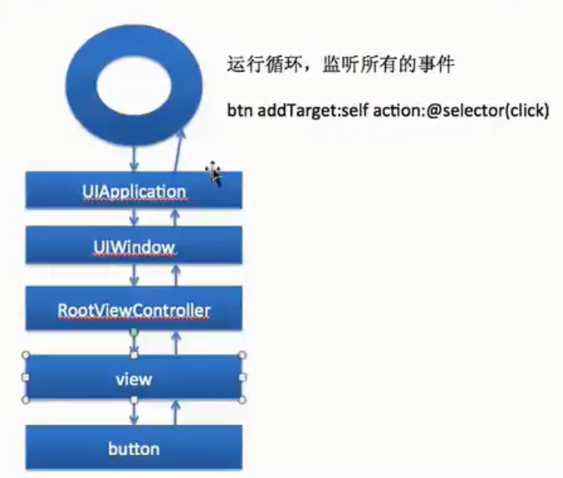

# 触摸事件

继承了UIResponder的类都有触摸事件，比如UIViewController，自定义View等。

```objc
// touches 有几个元素就表示有几个手指同时操作
- (void)touchesBegan:(NSSet<UITouch *> *)touches withEvent:(UIEvent *)event {
    // 按下
    UITouch * t = [touches anyObject];
    CGPoint point = [t locationInView:self.superview];
    // 点击的坐标
    NSLog(@"x=%f,y=%f", point.x, point.y);
}

// 移动
- (void)touchesMoved:(NSSet<UITouch *> *)touches withEvent:(UIEvent *)event {
    // 随手指移动
    UITouch * t = [touches anyObject];
    // 当前位置，也可以写 
    // CGPoint p = [t locationInView:t.view];
    CGPoint p = [t locationInView:self.superview];
    // 上一个点的位置
    CGPoint lastP = [t previousLocationInView:self.superview];
    // 偏移量
    CGFloat offsetX = p.x - lastP.x;
    CGFloat offestY = p.y - lastP.y;
    self.center = CGPointMake(self.center.x + offsetX, self.center.y + offestY);
}

- (void)touchesEnded:(NSSet<UITouch *> *)touches withEvent:(UIEvent *)event {
    // 抬起
}

- (void)touchesCancelled:(NSSet<UITouch *> *)touches withEvent:(UIEvent *)event {
    // 滑动被中断，比如来电话
}
```

## 事件传递

从上层向下层传递，和Android类似。



## 手势解锁(九宫格)

思路：

1. 自定义view，计算按钮位置，添加按钮；
2. 通过view的手势事件对比按钮的位置，决定是否显示选中，并重绘界面；
3. 将选中的按钮连线

## 手势识别

基于触摸事件，更方便。

```objc
//
//  ViewController.m
//  Autolayout
//
//  Created by dyb on 2020/8/26.
//  Copyright © 2020 ren. All rights reserved.
//

#import "ViewController.h"


@interface ViewController () <UIGestureRecognizerDelegate>
@property (weak, nonatomic) IBOutlet UIImageView *img;

@end

@implementation ViewController

- (void)viewDidLoad {
    [super viewDidLoad];
//    [self touch];
//    [self longPress];
//    [self swipe];
    [self rotate];
    [self pin];
//    [self pan];
}

// 解决手势冲突，返回YES
- (BOOL)gestureRecognizer:(UIGestureRecognizer *)gestureRecognizer shouldRecognizeSimultaneouslyWithGestureRecognizer:(UIGestureRecognizer *)otherGestureRecognizer {
    return YES;
}

// 拖拽
- (void) pan {
    UIPanGestureRecognizer *p = [[UIPanGestureRecognizer alloc] initWithTarget:self action:@selector(pan:)];
    [self.img addGestureRecognizer:p];
}

-(void) pan:(UIPanGestureRecognizer*) sender {
    CGPoint t = [sender translationInView:sender.view];
    NSLog(@"x=%f,y=%f", t.x, t.y);
    self.img.transform = CGAffineTransformTranslate(self.img.transform, t.x, t.y);
    [sender setTranslation:CGPointZero inView:sender.view]; // 同样要恢复初始状态
}

// 缩放
-(void) pin {
    UIPinchGestureRecognizer * pinch = [[UIPinchGestureRecognizer alloc] initWithTarget:self action:@selector(pinch:)];
    // 解决冲突设置一个代理即可
    pinch.delegate = self;
    [self.img addGestureRecognizer:pinch];
}

-(void) pinch:(UIPinchGestureRecognizer*) sender {
    NSLog(@"%f", sender.scale);
    self.img.transform = CGAffineTransformScale(self.img.transform, sender.scale, sender.scale);
    sender.scale = 1; // 同样要恢复初始状态
}

// 旋转手势
-(void) rotate {
    UIRotationGestureRecognizer * r = [[UIRotationGestureRecognizer alloc] initWithTarget:self action:@selector(rotation:)];
    [self.img addGestureRecognizer:r];
}

- (void) rotation:(UIRotationGestureRecognizer*) sender {
    NSLog(@"%f", sender.rotation);
    self.img.transform = CGAffineTransformRotate(self.img.transform, sender.rotation);
    sender.rotation = 0; // 设置为零之后每次的值就是偏移量，这样就可以累加了
}


// 轻扫事件
- (void) swipe {
    // 默认监听从左往右的事件
    UISwipeGestureRecognizer * swipeGest = [[UISwipeGestureRecognizer alloc] initWithTarget:self action:@selector(swipeGest:)];
    // 设置成左右都监听，最好重新添加一个监听手势，否则区分不了
    swipeGest.direction = UISwipeGestureRecognizerDirectionRight | UISwipeGestureRecognizerDirectionLeft;
    [self.img addGestureRecognizer:swipeGest];
}

- (void)swipeGest:(UISwipeGestureRecognizer*) sender {
    if (sender.direction == UISwipeGestureRecognizerDirectionLeft) {
        NSLog(@"左边");
    } else {
        NSLog(@"右边");
    }
}

-(void) longPress {
    // 长按，默认情况会在长按和抬起的时候都回调
    UILongPressGestureRecognizer * longPres = [[UILongPressGestureRecognizer alloc] initWithTarget:self action:@selector(longPres:)];
    // 长按时间
    longPres.minimumPressDuration = 1;
    // 长按时的范围，在范围内都算长按，默认10个像素
    longPres.allowableMovement = 100;
    [self.img addGestureRecognizer:longPres];
}

-(void) longPres:(UILongPressGestureRecognizer* ) sender {
    // 需要判断状态
    if (sender.state == UIGestureRecognizerStateBegan) {
        NSLog(@"长按了我");
    }
}

- (void) touch {
    // 创建手势对象
    UITapGestureRecognizer * recognizer = [[UITapGestureRecognizer alloc] initWithTarget:self action:@selector(recognizer:)];
    // 设置为双击
    recognizer.numberOfTapsRequired = 2;
    // 设置为同时有几个触摸点
    recognizer.numberOfTouchesRequired = 2;
    // view添加手势
    [self.img addGestureRecognizer:recognizer];
    // 实现手势方法
}


// 点击事件
- (void) recognizer:(UITapGestureRecognizer*) sender {
    NSLog(@"你点到我了");
}
@end

```