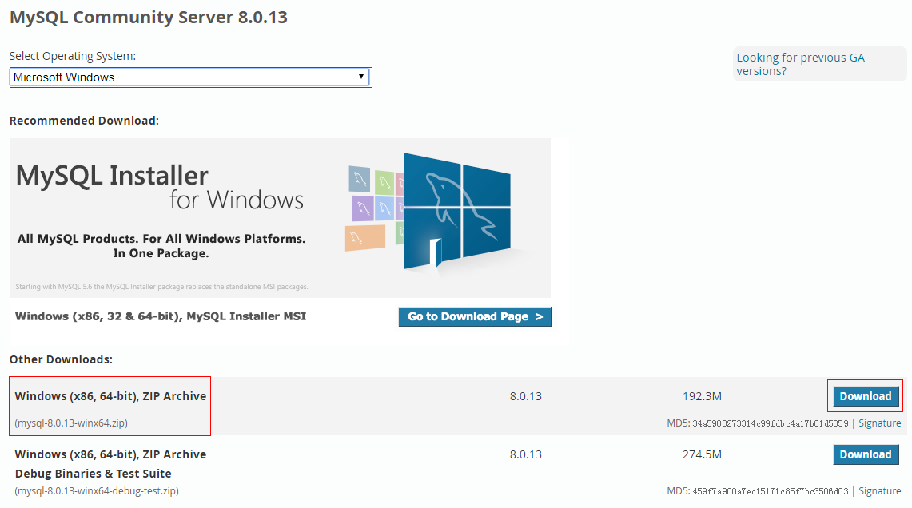
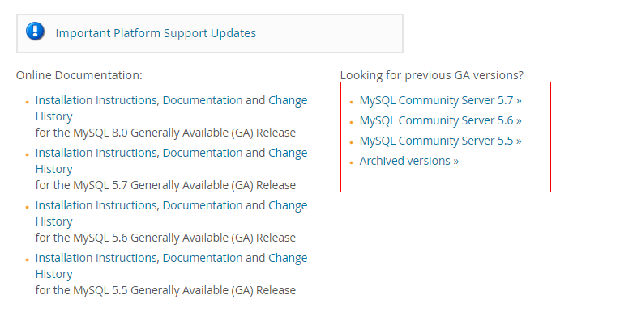

# WindowsServer2012使用Zip安装Mysql

> 感谢 https://my.oschina.net/happymzw/blog/645198 提供参考

使用Mysql Installer会安装很多用不到的功能，什么Mysql for Excel之类，所以用Zip方式安装比较直接。

## 一、下载Mysql Zip安装包

下载地址：http://dev.mysql.com/downloads/mysql



如图是8.0.13版本，如果想下载以前的版本在该页面上方一点，包括安装文档。



## 二、解压Zip

将下载下来的Zip解压到任意目录,比如`C:\\mysql`，并新建一个data目录，比如`C:\\mysql\\data`，用于存放数据库文件。

## 三、配置环境变量

把`C:\\mysql\\bin`目录加入到`path`变量即可。

## 四、配置启动文件

如果Mysql目录里有my-default.ini就复制一份，没有则自己新建，命名为**my.ini**。

``` ini
# For advice on how to change settings please see
# http://dev.mysql.com/doc/refman/5.7/en/server-configuration-defaults.html
# *** DO NOT EDIT THIS FILE. It's a template which will be copied to the
# *** default location during install, and will be replaced if you
# *** upgrade to a newer version of MySQL.

[mysqld]

# Remove leading # and set to the amount of RAM for the most important data
# cache in MySQL. Start at 70% of total RAM for dedicated server, else 10%.
# innodb_buffer_pool_size = 128M

# Remove leading # to turn on a very important data integrity option: logging
# changes to the binary log between backups.
# log_bin

# These are commonly set, remove the # and set as required.
# basedir = .....
# datadir = .....
# port = .....
# server_id = .....

#########################
# basedir 为安装文件解压后的目录 ｜ basedir和datadir 可以使用相对路径
# basedir=./..
basedir=C:\\mysql
# datadir 为用来存放数据的目录
# datadir=./../data
datadir=D:\\mysql\\data
# port 为端口号
port=3306
# mar_connections为最大连接数
max_connections=20
collation-server=utf8_unicode_ci
character-set-server=utf8
	
# Remove leading # to set options mainly useful for reporting servers.
# The server defaults are faster for transactions and fast SELECTs.
# Adjust sizes as needed, experiment to find the optimal values.
# join_buffer_size = 128M
# sort_buffer_size = 2M
# read_rnd_buffer_size = 2M 

explicit_defaults_for_timestamp=true
sql_mode=NO_ENGINE_SUBSTITUTION,STRICT_TRANS_TABLES
```

**注意：有的版本可能不需要配置data目录，可以阅读对应版本的文档。**

## 五、初始化数据目录

    mysqld --defaults-file="C:\mysql\my.ini" --initialize-insecure

这个命令很重要，它会初始化 data 目录，在执行此命令前请先把data目录下的所有文件先删除，否则会失败。

可以选择用 --initialize-insecure 或者 --initialize 来初始化，--initialize-insecure 初始化root密码为空，如果用 --initialize来初始化，会产生一个随机密码。

执行成功后你会在data目录 下看到 mysql，perofrmance_schema，sys目录，同时还会有一些文件。

## 六、安装启动Mysql服务

### 安装mysql服务

    mysqld -install


### 启动 mysql 服务

    net start mysql

到这里，mysql服务就启动好，我们就可以用root进入Mysql

    mysql -u root -p

记得改密码哟

    SET PASSWORD FOR root=PASSWORD('123456');

## 七、缺少api-ms-win-crt-runtime-l1-1-0.dll

初始化数据目录的时候失败，提示缺少api-ms-win-crt-runtime-l1-1-0.dll(或者其他类似的dll等)，需要安装Visual C++ Redistributable Packages，有2013、2015等多个版本，我刚开始选择2015版本，Windows Server 2012上安装不了，又换成了2013版才成功。

2013版下载地址：https://www.microsoft.com/zh-cn/download/confirmation.aspx?id=40784

2015版下载地址：https://www.microsoft.com/zh-cn/download/confirmation.aspx?id=48145

---

你以为到这就结束了？然而并没有。看了这个教程是不是觉得安装Mysql还是有点麻烦，尤其是遇到各种问题的时候。肿么办，有木有更简单的方法?答案当然是有啦。接下来Docker即将登场，一切都将变得简单。