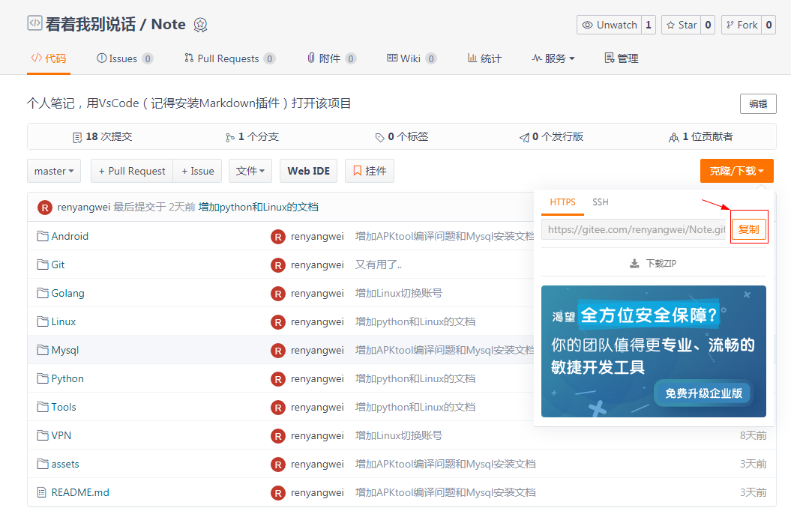
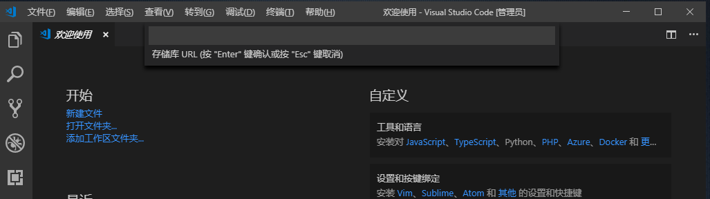
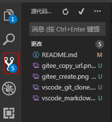

# Note

## 项目介绍

使用VsCode编辑的个人笔记本。

## 为什么要用Vscode

之前一直苦苦寻找一个跨平台的笔记工具，尝试过以下几种：

- Everynote
- 有道云笔记
- 简书

三个平台都有各自的缺点，Everynote不支持Markdowm，写代码感觉特别糟糕；有道云支持Markdowm，而且也挺好用，但是Mac版客户端打不开，本来想着Mac上用网页版，结果网页版都打不开(不知道是不是我网络的问题)；简书更适合写博客，不适合快速查找内容，而且笔记嘛，写下来自己看一看，很多时候没必要写成一篇文章。

最后没办法，看到Vscode这么强大，不仅跨平台，还支持Markdown文档分页预览，查找也快，更有一大堆插件，不如结合代码托管平台整个自己的笔记本工具。结果一试发现简直不能再好用。

## 准备工具

- [Git](https://git-scm.com/downloads)
- [Vscode](https://code.visualstudio.com/download)
- 远程仓库([Github](https://github.com/)、[码云](https://gitee.com/)等等)

## 一、新建远程仓库

这里以码云为例，登陆码云(没有账号先注册一个)，点击右上角"**+**"号 -> **新建仓库**，进入新建仓库界面，输入仓库名称、仓库介绍(选填)，点击创建。创建好仓库后复制仓库地址。

## 二、Vscode导入远程仓库

打开Vscode,按下`Shift + Ctrl + p`，打开输入命令`git clone`(有命令提示)，回车，然后输入刚刚复制的仓库地址，再回车就把远程仓库导入到本地了。

新安装的Vscode是英文，我们可以安装中文插件：点击上图左侧边栏第五个方形图标，搜索**Chinese**就能看到，安装完成会提示重启应用。

## 三、Markdown编辑笔记

在本地仓库新建Markdown文件，在上方文件栏右侧能看到几个图标，将鼠标放到上面将有提示“**打开侧边预览**”(我安装了Markdown Preview扩展，所以多显示一个),这样就能边编辑边预览，很舒服。

关于Markdown的语法介绍和相关编辑器，参考 http://itmyhome.com/markdown/。

## 四、上传到远程仓库

1. 打开左侧边栏第三个，源代码管理，说明你这次修改了什么，按 `Ctrl + Enter`，确认并提交；
2. 如图右侧三个点，选择**推送**，即可提交到远程仓库。

就这么简单，您学会了吗?