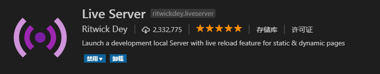
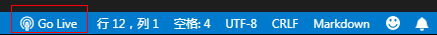

# VsCode配置本地服务器

不得不说，Vscode还是相当强大。配置本地服务器也是分分钟的事，再不用下载配置nginx了。

1. 打开VsCode的插件安装功能，搜索**live Server**，点击安装，然后点击重启以启用；
2. 从新启动VScode后，你会发现在软件的右下角的状态栏中出现了**Go Live**按钮；
3. 点击启动服务器，会自动运行系统默认的浏览器，默认显示项目中所有的文件和文件夹；
4. 回到VsCode再次点击即可关闭服务器；
5. 修改端口，点击**文件**>**首选项**>**设置**，搜索关键字**liveserver**一直往下找，我们可以找到live Server相关设置，liveServer.settings.port设置端口，liveServer.settings.proxy设置代理。

   
就这么简单，over！

## 发现问题

- 预览Markdown项目的时候显示不了图片

建议把图片放到本地